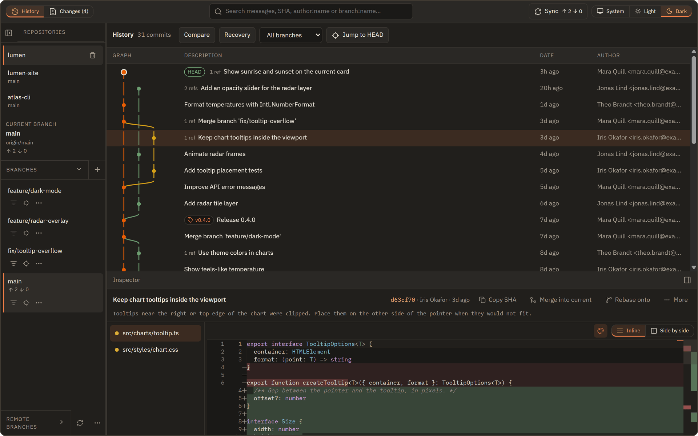
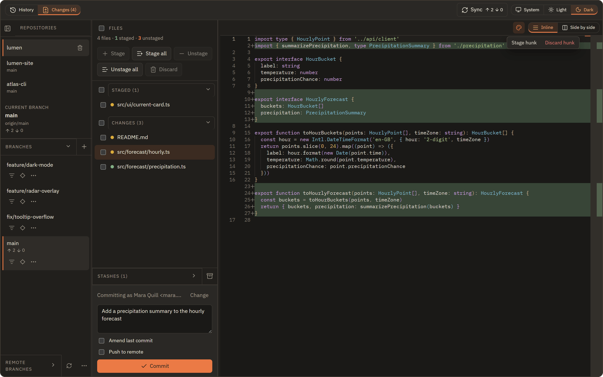
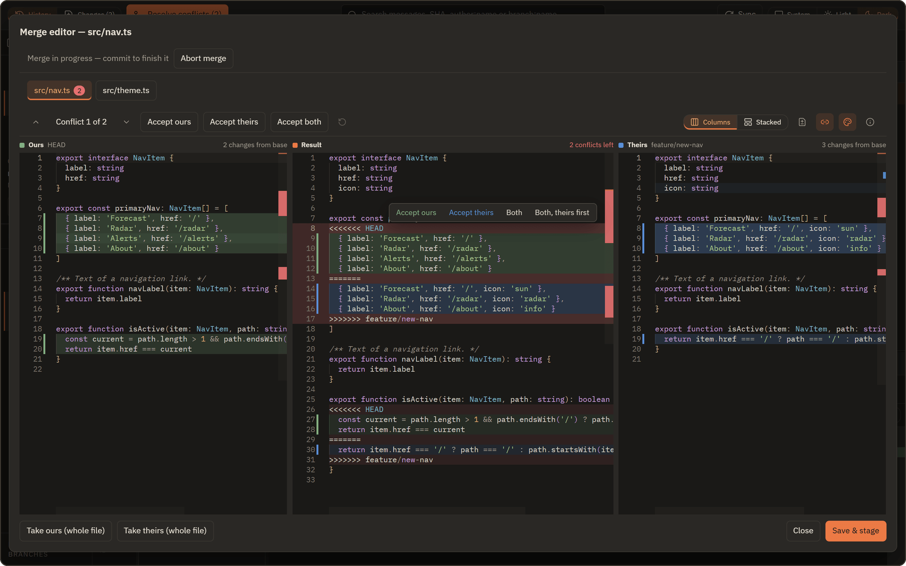
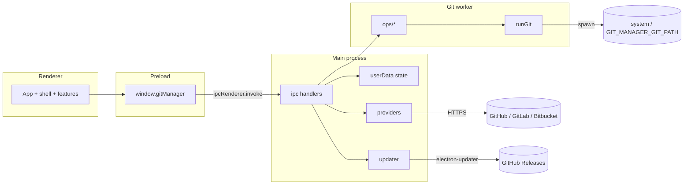

<p align="center">
  
</p>

<h1 align="center">Git Manager</h1>

<p align="center">
  <strong>History-first Git for the desktop.</strong><br />
  Search the commit graph, review inline or side-by-side diffs, resolve conflicts,<br />
  and clone from GitHub, GitLab or Bitbucket. For Windows, macOS and Linux.
</p>

<p align="center">
  <a href="https://github.com/Maks417/GitManager/actions/workflows/ci.yml"></a>
  <a href="https://github.com/Maks417/GitManager/releases"></a>
  
  <a href="LICENSE"></a>
</p>

<p align="center">
  <a href="https://maks417.github.io/GitManager/">Website</a> ·
  <a href="#features">Features</a> ·
  <a href="#install">Install</a> ·
  <a href="#connect-host-accounts">Host accounts</a> ·
  <a href="#search-history">Search</a> ·
  <a href="#keyboard">Keyboard</a> ·
  <a href="#build-from-source">Build</a> ·
  <a href="docs/index.md">Docs</a>
</p>

<picture>
  <source media="(prefers-color-scheme: dark)" srcset="docs/assets/screenshots/history-dark.png" />
  <source media="(prefers-color-scheme: light)" srcset="docs/assets/screenshots/history-light.png" />
  
</picture>

<p align="center"><sub>The commit graph across all branches. Selecting a commit shows its files and diff in the inspector.</sub></p>

## Features

<table>
  <tr>
    <td width="50%" valign="top">
      <picture>
        <source media="(prefers-color-scheme: dark)" srcset="docs/assets/screenshots/changes-dark.png" />
        <source media="(prefers-color-scheme: light)" srcset="docs/assets/screenshots/changes-light.png" />
        
      </picture>
      <p><strong>Working tree</strong><br />Stage, unstage, discard, stash and commit, with an inline or side-by-side diff of each change.</p>
    </td>
    <td width="50%" valign="top">
      <picture>
        <source media="(prefers-color-scheme: dark)" srcset="docs/assets/screenshots/merge-editor-dark.png" />
        <source media="(prefers-color-scheme: light)" srcset="docs/assets/screenshots/merge-editor-light.png" />
        
      </picture>
      <p><strong>Merge editor</strong><br />Jump from conflict to conflict and resolve each in place, with ours, the result and theirs colored and scrolling together.</p>
    </td>
  </tr>
</table>

| Feature | What it does |
|---|---|
| **History-first graph** | Large commit topology with search, branch filter, and inline or side-by-side diffs |
| **Working tree** | Stage whole files, hunks or lines; commit with a message draft saved per repository |
| **Branches & sync** | Create/switch branches, merge/rebase, fetch, pull and push; configure remotes and choose publication destinations |
| **Reference comparison** | Compare branches, tags or commits as exact snapshots or changes since their common ancestor |
| **Recovery** | Restore tracked-change backups and create branches from saved commits or recent HEAD history |
| **Commit actions** | Cherry-pick, revert, reset, create/delete tags and push tags from the commit actions menu |
| **File history & blame** | Follow a file across renames and see which commits introduced its lines |
| **Merge editor** | Three-way conflict resolution: colored conflicts and scrollbar marks, F7 navigation, inline accept actions, panes that scroll together, columns or stacked layout |
| **Host accounts** | GitHub, GitLab (including self-managed instances), and Bitbucket for browsing and cloning |
| **New repository** | Create a repository with its initial branch and a first README commit |
| **Clone** | HTTPS or SSH from URL or linked host listings, with progress and cancel |
| **Auto-updates** | Updates itself from [GitHub Releases](https://github.com/Maks417/GitManager/releases) on Windows and Linux; on macOS, install new versions from the releases page |

## Install

Download the latest build from **[Releases](https://github.com/Maks417/GitManager/releases)**:

| Platform | Download |
|---|---|
| **Windows** (x64, Arm64) | Installer (`.exe`) |
| **macOS** (Apple silicon) | Disk image (`.dmg`) or `.zip` |
| **Linux** (x64) | `.AppImage` for any distribution, or `.deb` for Ubuntu and Debian |

Builds are not code-signed yet, so the first launch needs one extra step:

- **Windows:** if SmartScreen appears, choose **More info → Run anyway**.
- **macOS:** open the app with right-click → **Open**, or run `xattr -cr "/Applications/Git Manager.app"`.
- **Linux:** make the AppImage executable (`chmod +x Git-Manager-*.AppImage`), or install the package with `sudo apt install ./Git-Manager-*.deb`.

On Windows and Linux the app then updates itself from the same releases. macOS updates need a signed build, so for now install new versions from the releases page.

### Requirements

- **Windows** 10 or 11, **macOS** on Apple silicon, or **Linux** x64
- **System Git** on `PATH`, or set `GIT_MANAGER_GIT_PATH` to a Git binary

The app probes for Git at startup and guides you to install it if missing.

## Connect host accounts

Use **Host accounts** from the welcome screen, or **Accounts** in the app menu, to link GitHub, GitLab (GitLab.com or your own instance), or Bitbucket. The app uses OS secure storage when available and marks accounts whose tokens were stored without OS encryption. It lists remote repos so you can clone them (HTTPS or SSH).

1. Open **Host accounts**.
2. Choose a provider.
3. Paste a personal access token (for a self-managed GitLab, also enter its address; for Bitbucket: an Atlassian API token plus your Atlassian account email).
4. Click **Connect**.
5. Select an account in the list to load remote repositories, then **Clone** a repo.

| Provider | Credential | Notes |
|---|---|---|
| **GitHub** | [Personal access token](https://github.com/settings/tokens) | Classic or fine-grained. Needs permission to read your profile and list repositories (private repos need repo access). |
| **GitLab** | [Personal access token](https://gitlab.com/-/user_settings/personal_access_tokens) | Needs API access to read your user and projects (e.g. `read_api`). For a self-managed instance, create the token there and enter the instance's HTTPS address, e.g. `https://gitlab.example.com`; leave the address empty for `gitlab.com`. |
| **Bitbucket** | [API token](https://id.atlassian.com/manage-profile/security/api-tokens) | Enter your Atlassian account **email** plus the API token (Bitbucket app passwords were retired). Needs read access to your account and repositories. |

Clone, fetch, and push still use your normal Git credentials: **HTTPS** via Git Credential Manager, **SSH** via your OpenSSH agent and keys. Connecting an account only unlocks browsing and one-click clone from the host listing.

More detail: [`docs/features/host-accounts.md`](docs/features/host-accounts.md).

## Search history

To review a whole feature branch, use **Compare…** above History, enter a base and target, and leave **Changes since common ancestor** checked. Uncheck it to compare exact snapshots. A commit's actions menu also offers **Compare with HEAD…**. [Reference comparison](docs/features/reference-comparison.md) explains the modes.

Type in the search box above the history and press Enter. Search runs in Git across all branches, unless you narrow it:

| Search | Finds |
|---|---|
| `fix login` | Commits whose message contains the text, ignoring case |
| `author:Ada` | Commits by that author |
| `3f2c1ab` | That commit (7–40 hex digits) |
| `branch:main` | The history of `main`, together with remote-tracking copies such as `origin/main` |
| `branch:feature/*` | The history of every branch the pattern matches (`*` and `?` are wildcards) |
| `branch:main fix` | A branch filter combined with a message search |

While you type, matching branches are suggested: <kbd>↑</kbd> / <kbd>↓</kbd> to pick one, <kbd>Enter</kbd> to show that branch, <kbd>Alt</kbd>+<kbd>Enter</kbd> (<kbd>Option</kbd>+<kbd>Enter</kbd> on macOS) to jump to its tip. Each branch in the sidebar also has **Show only this branch** and **Jump to tip**.

More detail: [`docs/features/history-graph.md`](docs/features/history-graph.md).

## Publish and recover work

**Repository → Remotes & Publishing…** adds or edits remote URLs, changes branch tracking and publishes the current branch to a selected remote/destination branch. The server repository must already exist. Fetch to load its branches before choosing an upstream. See [Remotes & publishing](docs/features/remotes-and-publishing.md).

Commit messages restore after switching views or repositories and after restarting. Successful commits clear their draft; failed commits keep it.

**Repository → Recovery…** (also above History) lists previous commits and tracked-change snapshots saved before amend, reset, rebase, branch deletion and tracked discard. Create a branch to recover a commit. Restore a snapshot onto a clean working tree/index to recover staged and unstaged edits. Untracked files discarded from Changes are in the Trash. See [Recovery](docs/features/recovery.md) for limits and retention.

## Keyboard

The app remembers its last maximized/full-screen mode. On startup, it opens saved repositories directly; repository setup appears when the saved list is empty.

| Key | Does |
|---|---|
| <kbd>F6</kbd> / <kbd>Shift</kbd>+<kbd>F6</kbd> | Move between the sidebar, history or changes, the inspector, and the search box |
| <kbd>F11</kbd> | Toggle full-screen mode (also in the View menu) |
| <kbd>↑</kbd> / <kbd>↓</kbd>, <kbd>PageUp</kbd> / <kbd>PageDown</kbd>, <kbd>Home</kbd> / <kbd>End</kbd> | Move through commits, changed files, repositories and branches |
| <kbd>Enter</kbd> | Commit list: go to the commit's files. Sidebar: open the repository or check out the branch |
| <kbd>Esc</kbd> | Commit files: back to the commit list. Menus and suggestions: close them |
| <kbd>Space</kbd> | Changes: check or uncheck the file |
| <kbd>Tab</kbd> | Leave a read-only diff |
| Arrow keys on a divider or column edge | Resize it (<kbd>Shift</kbd>: bigger steps; <kbd>Home</kbd> / <kbd>End</kbd>: smallest / largest) |

Menu shortcuts use <kbd>Ctrl</kbd> on Windows and <kbd>⌘</kbd> on macOS:

| Shortcut | Does |
|---|---|
| <kbd>Ctrl</kbd>+<kbd>1</kbd> / <kbd>Ctrl</kbd>+<kbd>2</kbd> | Show History / Changes |
| <kbd>Ctrl</kbd>+<kbd>F</kbd> | Focus the history search |
| <kbd>Ctrl</kbd>+<kbd>B</kbd> | Show or hide the sidebar |
| <kbd>Ctrl</kbd>+<kbd>Shift</kbd>+<kbd>D</kbd> | Dock the inspector at the bottom or on the right |
| <kbd>Ctrl</kbd>+<kbd>N</kbd>, <kbd>Ctrl</kbd>+<kbd>O</kbd>, <kbd>Ctrl</kbd>+<kbd>Shift</kbd>+<kbd>O</kbd> | New, add local, or clone a repository |
| <kbd>Ctrl</kbd>+<kbd>Shift</kbd>+<kbd>F</kbd> / <kbd>Ctrl</kbd>+<kbd>Shift</kbd>+<kbd>L</kbd> | Fetch / pull (push has no shortcut on purpose) |

## Build from source

Requires [Node.js](https://nodejs.org/) 22 and Git.

```bash
npm install
npm run dev
```

```bash
npm test
npm run typecheck
npm run lint
```

### Package

```bash
npm run dist        # current platform
npm run dist:win
npm run dist:mac
npm run dist:linux
```

Pushing a `v*` tag that matches `package.json` runs [`.github/workflows/release.yml`](.github/workflows/release.yml): it builds all three platforms and publishes the release with the built-in `GITHUB_TOKEN` after the required Windows and macOS jobs succeed; Linux is optional. Release notes come from `docs/releases/<version>.md` when present. Signing is optional: add `MAC_CSC_LINK`, `MAC_CSC_KEY_PASSWORD` and `APPLE_ID`, `APPLE_APP_SPECIFIC_PASSWORD`, `APPLE_TEAM_ID` for a notarized macOS build, or `WIN_CSC_LINK`, `WIN_CSC_KEY_PASSWORD` for Windows. Without them macOS builds are ad-hoc signed. See [release preparation](docs/releases.md) and the [1.2.0 release notes](docs/releases/1.2.0.md). The website in [`site/`](site/) deploys through [`.github/workflows/pages.yml`](.github/workflows/pages.yml).

## Architecture

| Layer | Role |
|---|---|
| `src/main` | Electron main — IPC, menus, secure storage, updater |
| `src/preload` | Narrow `contextBridge` API (`window.gitManager`) |
| `src/git-worker` | Git CLI runner and repository operations |
| `src/history-core` | Commit-graph layout and search helpers |
| `src/merge-core` | Conflict region model |
| `src/renderer` | History-first React UI |



Opening a repository lands on **History**. The graph uses most of the workspace; selecting a commit shows files and a Monaco diff, inline or side by side, with syntax colors for the file's language (the palette button turns them off).

Full write-up: [`docs/architecture.md`](docs/architecture.md).

## Documentation

| Doc | What's inside |
|---|---|
| [Docs index](docs/index.md) | Entry point for all project docs |
| [Architecture](docs/architecture.md) | Components, data flow, diagrams |
| [Domain model](docs/domain-model.md) | Entities and invariants |
| [Brandbook](docs/brandbook.md) | Ink & Ember design system |
| [Repository management](docs/features/repository-management.md) | Open, create, clone, remove |
| [History graph](docs/features/history-graph.md) | Topology UI |
| [Working tree](docs/features/working-tree.md) | Changes & commits |
| [Branches & sync](docs/features/branches-and-sync.md) | Branch ops and remotes |
| [Remotes & publishing](docs/features/remotes-and-publishing.md) | Remote URLs, upstreams and publication destinations |
| [Reference comparison](docs/features/reference-comparison.md) | Exact snapshots and feature-branch review |
| [Recovery](docs/features/recovery.md) | Saved commits, tracked-change snapshots and reflog |
| [Merge editor](docs/features/merge-editor.md) | Conflict resolution |
| [Host accounts](docs/features/host-accounts.md) | GitHub / GitLab / Bitbucket |
| [Auto-updates](docs/features/auto-updates.md) | Release updates |

## License

[MIT](LICENSE)
