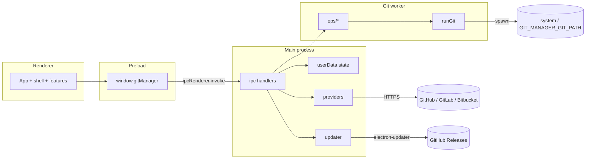

# Architecture

## Overview

Git Manager is an Electron desktop app (`electron-vite`) with a React renderer. The main process owns OS dialogs, secure storage, host API calls, and auto-updates. Git work runs through a CLI runner in [`src/git-worker`](../src/git-worker) (system Git by default), with operations split under [`src/git-worker/ops/`](../src/git-worker/ops/). Pure layout and conflict parsing live in [`src/history-core`](../src/history-core) and [`src/merge-core`](../src/merge-core). An optional OAuth broker under [`services/oauth-broker`](../services/oauth-broker) can exchange authorization codes so client secrets never ship in the app.

## Components

| Component | Responsibility | Key files |
|---|---|---|
| Electron main | Window, CSP, menus, native theme and window background, updater, repo watcher | [`src/main/index.ts`](../src/main/index.ts), [`src/main/menu.ts`](../src/main/menu.ts) |
| IPC handlers | Zod-validated channels by domain (repo, history, git, merge, providers, prefs, app/shell) | [`src/main/ipc.ts`](../src/main/ipc.ts), [`src/main/ipc/`](../src/main/ipc/) |
| Preload bridge | Narrow `contextBridge` API as `window.gitManager` | [`src/preload/index.ts`](../src/preload/index.ts) |
| Shared IPC contracts | Zod schemas, channel names, `GitManagerApi` | [`src/shared/ipc/`](../src/shared/ipc/) |
| Git worker | Spawn Git CLI; ops for repositories, worktrees, status, history, branches, merge, stash and identity | [`src/git-worker/git-runner.ts`](../src/git-worker/git-runner.ts), [`src/git-worker/ops/`](../src/git-worker/ops/), [`src/git-worker/operations.ts`](../src/git-worker/operations.ts) (barrel) |
| History core | Commit-graph lane layout and search helpers | [`src/history-core/layout.ts`](../src/history-core/layout.ts) |
| Merge core | Conflict-marker parse / region resolution | [`src/merge-core/conflict.ts`](../src/merge-core/conflict.ts) |
| Renderer shell | Welcome, toolbar, sidebar, workspace layout, every app dialog (`AppDialogs`) | [`src/renderer/src/shell/`](../src/renderer/src/shell/), [`src/renderer/src/App.tsx`](../src/renderer/src/App.tsx) |
| Renderer features | History, changes, merge editor, new repository, clone, repository removal, accounts, identity, updates, about | [`src/renderer/src/features/`](../src/renderer/src/features/) |
| Renderer state | React Context providers, outermost first: app status, layout, dialogs, selection, repo session (status in its own context), history, working tree, Git actions. Components read these instead of receiving props; each provider keeps actions in a separate, stable context | [`src/renderer/src/state/`](../src/renderer/src/state/) |
| Renderer hooks | Repo session, history paging, working tree, layout prefs (wrapped by the providers), menu commands | [`src/renderer/src/hooks/`](../src/renderer/src/hooks/) |
| Local state | Preferences, repo list, encrypted provider tokens | [`src/main/storage.ts`](../src/main/storage.ts) |
| Host providers | GitHub, GitLab (GitLab.com or a self-managed instance) and Bitbucket REST with tokens | [`src/main/providers/index.ts`](../src/main/providers/index.ts) |
| OAuth broker (optional) | Confidential-client code exchange | [`services/oauth-broker/server.ts`](../services/oauth-broker/server.ts) |

## How the parts connect

## Data flow

### Open repo → History

1. User opens or selects a repository; main validates the path via [`inspectRepository`](../src/git-worker/ops/repo.ts) and persists it in `repositories.json`.
2. Renderer calls `history.load` with path, optional search (message text, `author:`, `branch:` patterns), and optional current-branch filter from preferences ([`useHistory`](../src/renderer/src/hooks/useHistory.ts)).
3. Worker runs `git log` (custom format) over all refs, the current branch, or the branches a `branch:` search matches ([`branch-search.ts`](../src/shared/branch-search.ts), ref names on stdin), builds `Commit[]`, then [`layoutCommitGraph`](../src/history-core/layout.ts) produces `GraphNode[]`.
4. Selecting a commit loads `commitDetail` + `fileDiff` for the Monaco diff viewer. A commit's details never change, so details already shown for the selected commit are not loaded again, for example when coming back from Changes.

### Stage → commit → refresh

1. Changes view lists `repo.status` entries; stage/unstage/discard/commit go through `git:*` IPC ([`useWorkingTree`](../src/renderer/src/hooks/useWorkingTree.ts)).
2. Worker runs the corresponding Git commands; secrets in stderr/stdout are redacted in [`redactSecrets`](../src/git-worker/git-runner.ts).
3. Session hooks refresh branches, status, identity, rebase flag, then tip-refresh or reload history.

### Conflict resolve

1. Merge/rebase that leaves conflicts opens [`MergeEditorModal`](../src/renderer/src/features/merge-editor/MergeEditorModal.tsx).
2. Worker supplies base/ours/theirs from index stages 1–3 and the result from the work-tree file via `merge:get-sides` — Git's own merge, with markers only around real conflicts; merge-core parses markers into regions. Binary or oversized conflicts are resolved by taking a whole side (`merge:resolve-side`).
3. Saving writes the result and stages the path; rebase continue/abort are available when a rebase is in progress.

## Cross-cutting concerns

| Concern | Approach |
|---|---|
| Process isolation | `contextIsolation`, `sandbox`, no Node in renderer; DevTools disabled in production window prefs |
| Git worker | Electron `utilityProcess` (`git-utility.js`) on every platform; falls back to in-process ops if the worker cannot start |
| IPC trust | Handlers call `assertSender`, which accepts only the app's own top-level document (the exact `file://…/index.html`, or the dev-server origin when unpackaged). Payloads are validated with Zod: refs may not look like options, file paths must stay inside the repository, and git-worker ops re-check the same rules |
| Navigation & CSP | All navigation is blocked, including file drops. The CSP is a `<meta>` tag generated per build mode ([`electron.vite.config.ts`](../electron.vite.config.ts)); production allows no inline or eval scripts and no network access |
| Secrets | Provider tokens are encrypted with Electron `safeStorage` (DPAPI / Keychain / a Linux secret store) and each entry records its scheme ([`secrets.ts`](../src/main/secrets.ts)). Without OS encryption — including Linux `basic_text` — tokens are stored base64-encoded and the Accounts dialog says so. A token only goes to its account's host: repository listings follow paging links only while they stay on the API's origin ([`http.ts`](../src/main/providers/http.ts)). Git URL credentials are redacted in CLI output |
| Preferences & state | Zod-validated `AppPreferences` in `userData/state/preferences.json`; each invalid field falls back on its own (sizes are clamped), so a bad file never blocks startup. State files are written atomically (temp file + rename); a corrupt file is kept aside as `*.corrupt-<time>` ([`json-store.ts`](../src/main/json-store.ts)). One app instance runs per profile |
| Theme | `system` \| `light` \| `dark` → CSS `[data-theme]` + window background + Monaco theme + Electron `nativeTheme.themeSource` ([`theme.ts`](../src/main/theme.ts)), set before the window is created. The page CSS cannot reach the window frame, title bar or Windows/Linux menu bar, and the renderer's `prefers-color-scheme` follows `themeSource` too. Monaco and text fields use an explicit I-beam (`--cursor-text`): some GPU drivers draw the system XOR I-beam solid white |
| Updates | `electron-updater` against GitHub Releases when packaged; no-op check in dev |
| About | [`AboutModal`](../src/renderer/src/features/about/AboutModal.tsx) shows `AppInfo` (`app:get-info`) and links to releases/license |
| Git binary | `GIT_MANAGER_GIT_PATH` override, else `git` / `git.exe`; startup `git.probe` / `probeGit` surfaces missing CLI (incl. macOS CLT stub) |
| Live status | Recursive `fs.watch` on the active repo ([`repo-watcher.ts`](../src/main/repo-watcher.ts)); preference `liveStatusWatch` (default on). Linked worktrees and submodules keep HEAD, the index and refs outside the work tree, so those git directories (`git rev-parse --git-dir --git-common-dir`) are watched as well. When the system refuses more watches (`ENOSPC`, Linux's inotify limit, or `EMFILE`), the repository is polled instead: every 5 seconds while an app window is focused, a fingerprint of `git status --porcelain=v2 --branch` and `git for-each-ref` is compared ([`watch.ts`](../src/git-worker/ops/watch.ts)). The watch state (`live` or `polling`, with the reason) reaches the renderer as `repo:on-watch-state` and as the reply to `repo:watch`, and a dismissible banner explains it |
| Worktrees | A linked worktree records its main work tree (`Repository.worktreeOf`): its git directory is `<common dir>/worktrees/<id>`, and `git worktree list --porcelain` names the main work tree first. Once its folder is gone, that administrative folder — Git's record of the worktree, found through its `gitdir` file — can still be removed. Only that one goes, where `git worktree prune` would drop every missing worktree. Locked worktrees keep their record, and so do worktrees whose detached HEAD holds commits on no branch, tag or remote ([`worktrees.ts`](../src/git-worker/ops/worktrees.ts)) |
| Lint | `npm run lint` (also in CI): ESLint with the `recommended-latest` rules of `eslint-plugin-react-hooks`, as errors. That is the rules of hooks and `exhaustive-deps`, plus the React Compiler checks, such as refs read during render and state set synchronously in an effect ([`eslint.config.mjs`](../eslint.config.mjs)). Unused disable comments are errors too. Effects read the latest props through `useEffectEvent` or [`useLatestRef`](../src/renderer/src/hooks/useLatestRef.ts), and state that belongs to one repository or file is stored with its key instead of being reset in an effect. Types stay with `npm run typecheck` |
| Diff viewer | Monaco diff editors are created directly, one per file version ([`FileDiffViewer`](../src/renderer/src/features/diff/FileDiffViewer.tsx)). They show the diff inline or side by side as `AppPreferences.diffView` says ([`DiffViewSwitch`](../src/renderer/src/features/diff/DiffViewSwitch.tsx)); switching updates the open editor's options instead of creating a new editor. Monaco's switch to inline for narrow editors (`useInlineViewWhenSpaceIsLimited`) is off, so side by side stays side by side. Monaco's diff worker handles one diff at a time and never cancels a closed editor's computation, so teardown waits until the editor's diff has arrived before disposing the editor and then its models ([`monaco-lifecycle.ts`](../src/renderer/src/logic/monaco-lifecycle.ts)). The revert/stage gutter menu is off. Monaco is loaded without its language services ([`monaco-api.ts`](../src/renderer/src/lib/monaco-api.ts); lint rejects other imports of `monaco-editor`): colors come from Monarch grammars, JSON keeps only its main-thread tokenizer, and the editor worker is the only worker. A TypeScript or JavaScript diff would otherwise start a worker with the whole TypeScript compiler that Monaco never stops |
| Session refreshes | Overlapping refreshes of the active repository (watcher events, Git actions) may finish in any order; only the newest applies its branches and status ([`latest-gate.ts`](../src/renderer/src/logic/latest-gate.ts)). A history list belongs to one repository and filter, and results for another are dropped. The busy indicator counts running actions, so the first to finish does not clear it for the rest |
| Network operations | Fetch, pull, push and clone stream Git's `--progress` from the git worker to the window that started them (`git:on-progress`) and stop on `git:cancel-operation` ([`remote-ops.ts`](../src/main/remote-ops.ts)). The git-worker methods that take a cancel signal and a progress callback are listed in `CANCELLABLE_GIT_METHODS` ([`method-registry.ts`](../src/git-worker/method-registry.ts)). The runner starts them in their own process group (`taskkill /T` on Windows), so cancelling also stops Git's helpers. A stopped operation settles when Git has exited, or after 5 seconds at most, so a cancelled clone's folder is free to remove. Operations fail after 5 minutes without output ([`git-runner.ts`](../src/git-worker/git-runner.ts), [`progress.ts`](../src/git-worker/progress.ts)). The renderer runs one fetch, pull or push at a time |
| Dialogs | Confirmations are in-app dialogs from `useConfirm()` ([`ConfirmProvider`](../src/renderer/src/state/ConfirmProvider.tsx)), shown one at a time. Every dialog registers on a stack ([`Modal`](../src/renderer/src/components/ui/Modal.tsx)): Escape and the Tab focus trap apply to the top dialog, focus returns to the element that opened it, and only a press that starts and ends on the backdrop closes it. The merge editor closes only through its own buttons |
| Keyboard | Lists keep focus on the list and move the active row (`aria-activedescendant`: commits, commit files, changes) or share one Tab stop between rows (sidebar, [`useRovingList`](../src/renderer/src/hooks/useRovingList.ts)); key handling is pure ([`list-nav.ts`](../src/renderer/src/logic/list-nav.ts), [`resize-keys.ts`](../src/renderer/src/logic/resize-keys.ts)). F6 cycles the panes marked `data-pane` ([`usePaneCycling`](../src/renderer/src/hooks/usePaneCycling.ts)). Tab leaves read-only Monaco editors ([`monaco-keys.ts`](../src/renderer/src/lib/monaco-keys.ts)) |
| Packaging | Windows NSIS + macOS DMG primary; Linux AppImage also defined in [`electron-builder.yml`](../electron-builder.yml). The renderer bundle is minified ([`electron.vite.config.ts`](../electron.vite.config.ts)): electron-vite leaves it unminified, and the page keeps the source of every script it loads in memory |
