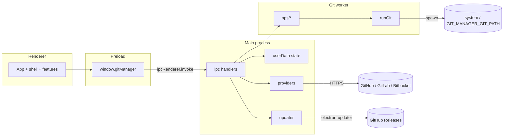

# Architecture

## Overview

Git Manager is an Electron desktop app (`electron-vite`) with a React renderer. The main process owns OS dialogs, secure storage, host API calls, and auto-updates. Git work runs through a CLI runner in [`src/git-worker`](../src/git-worker) (system Git by default), with operations split under [`src/git-worker/ops/`](../src/git-worker/ops/). Pure layout and conflict parsing live in [`src/history-core`](../src/history-core) and [`src/merge-core`](../src/merge-core). An optional OAuth broker under [`services/oauth-broker`](../services/oauth-broker) can exchange authorization codes so client secrets never ship in the app.

## Components

| Component | Responsibility | Key files |
|---|---|---|
| Electron main | Window, CSP, menus, theme background, updater, repo watcher | [`src/main/index.ts`](../src/main/index.ts), [`src/main/menu.ts`](../src/main/menu.ts) |
| IPC handlers | Zod-validated channels by domain (repo, history, git, merge, providers, prefs, app/shell) | [`src/main/ipc.ts`](../src/main/ipc.ts), [`src/main/ipc/`](../src/main/ipc/) |
| Preload bridge | Narrow `contextBridge` API as `window.gitManager` | [`src/preload/index.ts`](../src/preload/index.ts) |
| Shared IPC contracts | Zod schemas, channel names, `GitManagerApi` | [`src/shared/ipc/`](../src/shared/ipc/) |
| Git worker | Spawn Git CLI; ops for status/history/branches/merge/stash/identity | [`src/git-worker/git-runner.ts`](../src/git-worker/git-runner.ts), [`src/git-worker/ops/`](../src/git-worker/ops/), [`src/git-worker/operations.ts`](../src/git-worker/operations.ts) (barrel) |
| History core | Commit-graph lane layout and search helpers | [`src/history-core/layout.ts`](../src/history-core/layout.ts) |
| Merge core | Conflict-marker parse / region resolution | [`src/merge-core/conflict.ts`](../src/merge-core/conflict.ts) |
| Renderer shell | Welcome, toolbar, sidebar, workspace layout | [`src/renderer/src/shell/`](../src/renderer/src/shell/), [`src/renderer/src/App.tsx`](../src/renderer/src/App.tsx) |
| Renderer features | History, changes, merge editor, clone, accounts, identity, updates, about | [`src/renderer/src/features/`](../src/renderer/src/features/) |
| Renderer hooks | Repo session, history paging, working tree, layout prefs | [`src/renderer/src/hooks/`](../src/renderer/src/hooks/) |
| Local state | Preferences, repo list, encrypted provider tokens | [`src/main/storage.ts`](../src/main/storage.ts) |
| Host providers | GitHub / GitLab / Bitbucket REST with PAT | [`src/main/providers/index.ts`](../src/main/providers/index.ts) |
| OAuth broker (optional) | Confidential-client code exchange | [`services/oauth-broker/server.ts`](../services/oauth-broker/server.ts) |

## How the parts connect

## Data flow

### Open repo → History

1. User opens or selects a repository; main validates the path via [`inspectRepository`](../src/git-worker/ops/repo.ts) and persists it in `repositories.json`.
2. Renderer calls `history.load` with path, optional search, and optional current-branch filter from preferences ([`useHistory`](../src/renderer/src/hooks/useHistory.ts)).
3. Worker runs `git log` (custom format), builds `Commit[]`, then [`layoutCommitGraph`](../src/history-core/layout.ts) produces `GraphNode[]`.
4. Selecting a commit loads `commitDetail` + `fileDiff` for the Monaco side-by-side viewer.

### Stage → commit → refresh

1. Changes view lists `repo.status` entries; stage/unstage/discard/commit go through `git:*` IPC ([`useWorkingTree`](../src/renderer/src/hooks/useWorkingTree.ts)).
2. Worker runs the corresponding Git commands; secrets in stderr/stdout are redacted in [`redactSecrets`](../src/git-worker/git-runner.ts).
3. Session hooks refresh branches, status, identity, rebase flag, then tip-refresh or reload history.

### Conflict resolve

1. Merge/rebase that leaves conflicts opens [`MergeEditorModal`](../src/renderer/src/features/merge-editor/MergeEditorModal.tsx).
2. Worker supplies base/ours/theirs/result via `merge:get-sides`; merge-core parses markers into regions.
3. Saving writes the result and stages the path; rebase continue/abort are available when a rebase is in progress.

## Cross-cutting concerns

| Concern | Approach |
|---|---|
| Process isolation | `contextIsolation`, `sandbox`, no Node in renderer; DevTools disabled in production window prefs |
| Git worker | Prefer Electron `utilityProcess` (`git-utility.js`) on Windows and macOS; fall back to in-process ops |
| IPC trust | Handlers call `assertSender`; payloads validated with Zod where schemas exist |
| Secrets | Provider tokens via Electron `safeStorage` when available ([`storage.ts`](../src/main/storage.ts)); Git URL credentials redacted in CLI output |
| Preferences | Zod-validated `AppPreferences` in `userData/state/preferences.json` |
| Theme | `system` \| `light` \| `dark` → CSS `[data-theme]` + window background + Monaco theme |
| Updates | `electron-updater` against GitHub Releases when packaged; no-op check in dev |
| About | [`AboutModal`](../src/renderer/src/features/about/AboutModal.tsx) shows `AppInfo` (`app:get-info`) and links to releases/license |
| Git binary | `GIT_MANAGER_GIT_PATH` override, else `git` / `git.exe`; startup `git.probe` / `probeGit` surfaces missing CLI (incl. macOS CLT stub) |
| Live status | Recursive `fs.watch` on the active repo ([`repo-watcher.ts`](../src/main/repo-watcher.ts)); preference `liveStatusWatch` (default on) |
| Packaging | Windows NSIS + macOS DMG primary; Linux AppImage also defined in [`electron-builder.yml`](../electron-builder.yml) |
