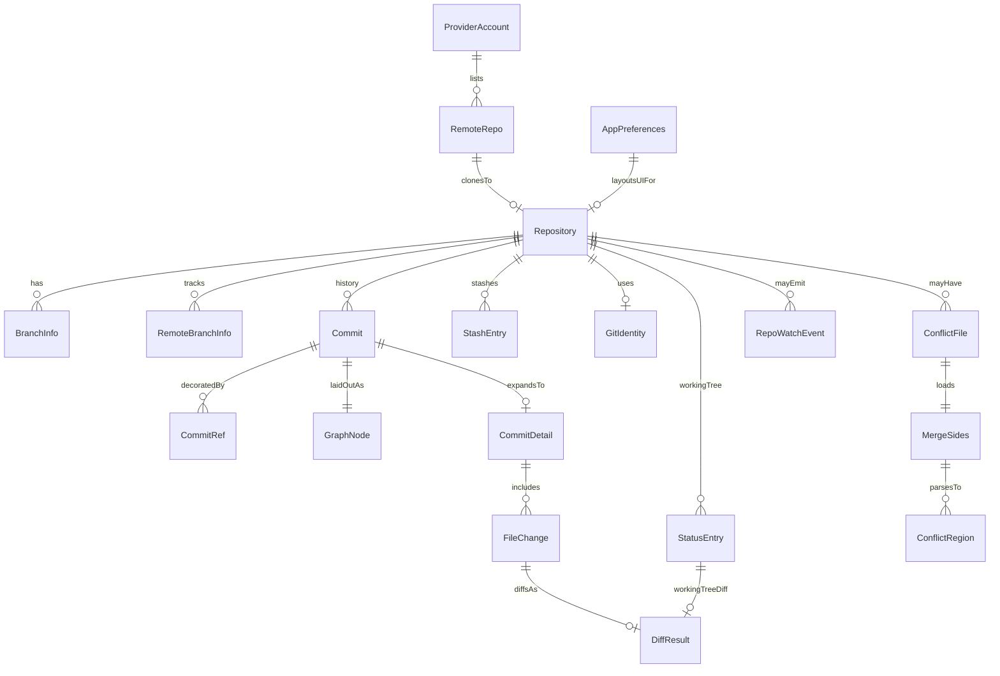

# Domain model

## Entities

| Entity | Description | Key fields |
|---|---|---|
| Repository | Local Git repo tracked by the app | `id`, `name`, `path`, `currentBranch`, `remotes[]` |
| Commit | History entry from `git log` | `sha`, `shortSha`, `subject`, `body`, author, `authoredAt`, `parents[]`, `refs[]` |
| CommitRef | Decorations on a commit | `name`, `type` (`local` \| `remote` \| `tag` \| `head`), optional `color` |
| GraphNode | Layout of one commit in the topology graph | `sha`, `lane`, `lanes[]`, `passThrough[]`, `joins[]`, `hasIncoming`, `connections[]` |
| HistoryPage | Paged history payload | `commits`, `graph`, `nextCursor`, `headSha` |
| FileChange | File touched by a commit | `path`, `status`, optional stats / `oldPath` |
| CommitDetail | Commit + changed files | `commit`, `files` |
| DiffResult | Text for Monaco (or binary flag) | `path`, `oldText`, `newText`, `binary`, `language?` |
| StatusEntry | Working-tree / index status line | `path`, index/worktree letters, `staged`, `unstaged`, `untracked`, `conflicted` |
| BranchInfo | Local branch + upstream divergence | `name`, `current`, `upstream`, `ahead`, `behind` |
| RemoteBranchInfo | Remote-tracking branch short name | `name`, `remote` |
| StashEntry | Stash reflog entry | `index`, `message`, `reflogSelector` |
| ConflictFile | Path with unmerged stages | `path`, `hasBase`, `hasOurs`, `hasTheirs` |
| MergeSides | Three-way content + work-tree result | `path`, `base`, `ours`, `theirs`, `result`, `binary`, `tooLarge` |
| RepoRemovalInfo | What deleting a repository folder would lose | `uncommitted`, `stashes`, `unpushed` |
| ConflictRegion | Parsed conflict markers (merge-core) | line range, `ours` / `theirs` / `base?`, resolution |
| ProviderAccount | Connected host account (no token in API) | `id`, `provider`, `username`, `displayName`, `host` |
| RemoteRepo | Host repo available to clone | clone URLs, `fullName`, `defaultBranch`, `webUrl` |
| GitIdentity | Effective `user.name` / `user.email` | values + `nameSource` / `emailSource` scopes |
| GitProbeResult | Startup Git CLI availability | `available`, `version`, `message` |
| AppInfo | About-dialog metadata | `name`, `version`, `architecture`, `homepage` |
| AppPreferences | UI layout and behavior prefs | theme, dock, column widths, filters, live watch, etc. |
| RepoWatchEvent | Live FS watch notification | `repoPath`, `kind` (`worktree` \| `git-meta`) |
| UpdateStatus | Auto-update progress | checking / available / downloaded / version / error / progress |

Schemas: [`src/shared/ipc/schemas.ts`](../src/shared/ipc/schemas.ts). Conflict regions: [`src/merge-core/conflict.ts`](../src/merge-core/conflict.ts).

## Relationships

## Persistence

| Store file (`userData/state/`) | Contents |
|---|---|
| `repositories.json` | Saved `Repository[]` |
| `preferences.json` | `AppPreferences` |
| `accounts.json` | Provider accounts + `tokenEnc`, `tokenScheme` and (Bitbucket) `authUser` — none exposed over IPC |

Git objects themselves live on disk under each repository’s `.git`; the app does not mirror the object database.

## Preference notes

| Pref | Behavior |
|---|---|
| `liveStatusWatch` | Default on; drives [`repo-watcher.ts`](../src/main/repo-watcher.ts) |
| `statusUntracked` | `normal` (default) or `all` for `git status` |
| `historyFilter` | `all` or `current` branch |
| `externalEditor` / `externalTerminal` | Present in schema; **not wired in UI yet** (`_TBD_`: open file/folder in configured tools) |
| `checkUpdatesOnStart` | Packaged builds may auto-check on launch |

## Invariants

- A `Repository.path` must be a valid Git work tree before add/create/clone succeeds ([`inspectRepository`](../src/git-worker/ops/repo.ts)).
- IPC list of accounts never returns token material — only metadata ([`providers-handlers.ts`](../src/main/ipc/providers-handlers.ts) strips `tokenEnc`, `tokenScheme` and `authUser`).
- History graph lanes are derived from parent topology in log order; they are not persisted ([`layoutCommitGraph`](../src/history-core/layout.ts)).
- `StatusEntry.conflicted` / unmerged paths drive merge-editor open; saving a merge result stages the path.
- Preferences and identity mutations are validated with Zod (`AppPreferencesSchema`, `SetGitIdentityRequestSchema`).
- Effective identity sources follow Git’s local → global → system lookup; unset is explicit when missing.
- Git CLI output may contain secrets; user-facing error strings go through redaction in the runner.
