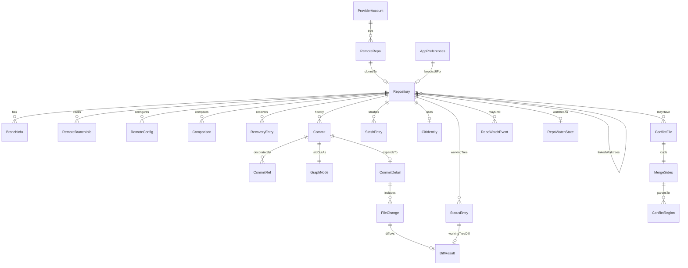

# Domain model

## Entities

| Entity | Description | Key fields |
|---|---|---|
| Repository | Local Git repo tracked by the app | `id`, `name`, `path`, `currentBranch`, `remotes[]`, `worktreeOf` (main work tree of a linked worktree, else null) |
| Commit | History entry from `git log` | `sha`, `shortSha`, `subject`, `body`, author, `authoredAt`, `parents[]`, `refs[]` |
| CommitRef | Decorations on a commit | `name`, `type` (`local` \| `remote` \| `tag` \| `head`), optional `color` |
| GraphNode | Layout of one commit in the topology graph | `sha`, `lane`, `lanes[]`, `passThrough[]`, `joins[]`, `hasIncoming`, `connections[]` |
| HistoryQuery | Request for a history page | `repoPath`, `search` (text, `author:`, `branch:`), `branch` (current-branch filter), `skip`, `limit`, `revealSha` (load down to a commit) |
| HistoryPage | Paged history payload | `commits`, `graph`, `nextCursor`, `headSha`; `branches` and `notice` for a `branch:` search; `revealed` for a jump |
| FileChange | File touched by a commit | `path`, `status`, optional stats / `oldPath` |
| CommitDetail | Commit + changed files | `commit`, `files` |
| DiffResult | Text for Monaco (or binary flag) | `path`, `oldText`, `newText`, `binary` (the renderer picks the syntax language from `path`) |
| StatusEntry | Working-tree / index status line | `path`, index/worktree letters, `staged`, `unstaged`, `untracked`, `conflicted`, optional `oldPath` (rename source) |
| BranchInfo | Local branch + upstream divergence | `name`, `current`, `upstream`, `ahead`, `behind`, `sha` (tip; null before the first commit) |
| RemoteBranchInfo | Remote-tracking branch | `name`, `remote`, `shortName`, `sha` |
| RemoteConfig | Remote URLs in the configuration dialog | `name`, `fetchUrl`, `pushUrl` |
| Comparison | File changes between resolved snapshots | `baseSha`, `targetSha`, `files`, `additions`, `deletions`, `binaryFiles` |
| RecoveryEntry | Saved backup or recent HEAD reflog entry | `id`, `sha`, `kind` (`commit` or `worktree`), `label`, `createdAt`, `saved` |
| StashEntry | Stash reflog entry | `index`, `message`, `reflogSelector` |
| ConflictFile | Path with unmerged stages | `path`, `hasBase`, `hasOurs`, `hasTheirs` |
| MergeSides | Three-way content + work-tree result | `path`, `base`, `ours`, `theirs`, `result`, `binary`, `tooLarge` |
| RepoRemovalInfo | What deleting a repository folder would lose | `uncommitted`, `stashes`, `unpushed` (a linked worktree counts only `uncommitted`: the rest stays in its main repository) |
| WorktreeInfo | How a listed repository relates to other worktrees | `exists`, `linkedTo` (`mainPath`, `mainExists`, `locked`; null unless a linked worktree), `otherWorktrees` (linked worktrees that still use a main work tree) |
| RepoRemoveOptions | How to remove a repository from the list | `deleteFiles` (move the folder to the Trash), `pruneWorktree` (remove Git's record of a linked worktree) |
| RepoRemoveResult | What is left to say once the repository is off the list | `warning` (why Git still lists the worktree), or null |
| NewRepoTarget | Where a new repository would be created, checked before anything is written | `path`, `problem`, `insideRepo`, `defaultBranch`, `suggestedParent` |
| CreateRepoRequest | Create a repository | `parentDir`, `name`, `initialBranch`, `readme` (commit a README.md) |
| CreateRepoResult | The created repository | `repo`, `warning` (set when only the first commit failed) |
| CloneRequest | Clone into a new folder inside a parent folder | `url`, `targetDir` (the parent), `opId` |
| CloneResult | How a clone ended | `outcome` (`done` with `repo` \| `cancelled`) |
| ConflictRegion | Parsed conflict markers (merge-core) | line range, `ours` / `theirs` / `base?`, resolution |
| ProviderAccount | Connected host account (no token in API) | `id`, `provider`, `username`, `displayName`, `host`, `baseUrl` (self-managed GitLab only) |
| RemoteRepo | Host repo available to clone | clone URLs, `fullName`, `defaultBranch`, `webUrl` |
| GitIdentity | Effective `user.name` / `user.email` | values + `nameSource` / `emailSource` scopes |
| GitProbeResult | Startup Git CLI availability | `available`, `version`, `message` |
| AppInfo | About-dialog metadata | `name`, `version`, `architecture`, `homepage` |
| AppPreferences | UI layout and behavior prefs | theme, dock, diff view, column widths, filters, live watch, etc. |
| RepoWatchEvent | Live FS watch notification | `repoPath`, `kind` (`worktree` \| `git-meta`) |
| RepoWatchState | How the watched repository is kept up to date | `repoPath`, `mode` (`live` \| `polling`), `reason` (why it is polled) |
| RemoteOpRequest | Start a fetch, pull or push | `repoPath`, `opId`, optional `force`; paired `remote` and `targetBranch` for explicit publication |
| GitProgress | Progress of a running fetch, pull, push or clone | `opId`, `repoPath` (the new folder, for a clone), `kind`, `phase`, `percent`, `cancellable` |
| RemoteOpResult | How a fetch, pull or push ended | `outcome` (`done` \| `cancelled` \| `rejected` \| `diverged`), optional `branch` / `upstream` |
| UpdateStatus | Auto-update progress | checking / available / downloaded / version / error / progress |

Schemas: [`src/shared/ipc/schemas.ts`](../src/shared/ipc/schemas.ts). Conflict regions: [`src/merge-core/conflict.ts`](../src/merge-core/conflict.ts).

## Relationships

## Persistence

| Store file (`userData/state/`) | Contents |
|---|---|
| `repositories.json` | Saved `Repository[]` |
| `preferences.json` | `AppPreferences` |
| `window.json` | Last maximized/full-screen mode, owned by the main process |
| `accounts.json` | Provider accounts (with `baseUrl` for a self-managed GitLab) + `tokenEnc`, `tokenScheme` and (Bitbucket) `authUser` — none of those three exposed over IPC |

Git objects themselves live on disk under each repository’s `.git`; the app does not mirror the object database.

Commit drafts use Chromium local storage under `git-manager:commit-draft:<repository path>`, with an in-memory fallback if storage fails. Saved recovery backups use Git refs under `refs/git-manager/recovery/` and the normal object database; they are shared across linked worktrees.

## Preference notes

| Pref | Behavior |
|---|---|
| `liveStatusWatch` | Default on; drives [`repo-watcher.ts`](../src/main/repo-watcher.ts) |
| `historyFilter` | `all` or `current` branch |
| `externalEditor` / `externalTerminal` | Present in schema; **not wired in UI yet** (`_TBD_`: open file/folder in configured tools) |
| `checkUpdatesOnStart` | Packaged builds may auto-check on launch |

## Invariants

- A `Repository.path` must be a valid Git work tree before add/create/clone succeeds ([`inspectRepository`](../src/git-worker/ops/repo.ts)).
- A linked worktree's `worktreeOf` is recorded while its folder exists and kept once the folder is gone, so Git's record of it can still be pruned from the main repository ([`worktrees.ts`](../src/git-worker/ops/worktrees.ts)).
- Removing a repository never deletes files permanently: its folder goes to the Trash. Removing a linked worktree's record deletes only Git's administrative folder for that one worktree, once its folder is gone, and never while it is locked or its detached HEAD holds commits on no branch, tag or remote.
- IPC list of accounts never returns token material — only metadata ([`providers-handlers.ts`](../src/main/ipc/providers-handlers.ts) strips `tokenEnc`, `tokenScheme` and `authUser`).
- A self-managed GitLab account's id names its instance (`gitlab:<host>:<user id>`); GitLab.com accounts keep `gitlab:<user id>`. Host requests carry a token only to its account's API origin.
- History graph lanes are derived from parent topology in log order; they are not persisted ([`layoutCommitGraph`](../src/history-core/layout.ts)).
- `StatusEntry.conflicted` / unmerged paths drive merge-editor open; saving a merge result stages the path.
- Preferences and identity mutations are validated with Zod (`AppPreferencesSchema`, `SetGitIdentityRequestSchema`).
- Effective identity sources follow Git’s local → global → system lookup; unset is explicit when missing.
- Git CLI output may contain secrets; user-facing error strings go through redaction in the runner.
