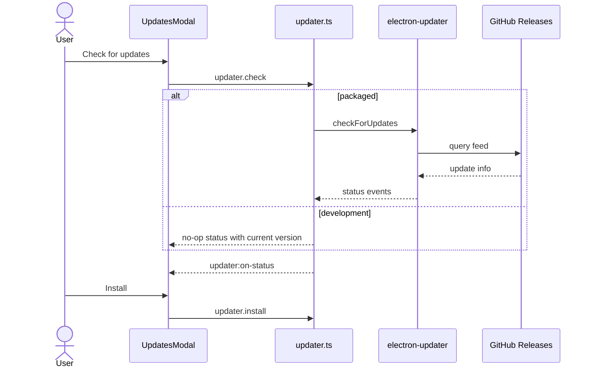

# Feature: Auto-updates

## Purpose

Check for and install signed updates published to GitHub Releases via `electron-updater`, with a status UI in the renderer.

## User flow

1. On startup (if `checkUpdatesOnStart`), packaged builds check for updates.
2. User can open Updates modal to check status, see version/notes/progress, and install when downloaded.
3. Dev (unpackaged) checks simulate a no-op so the UI can be exercised without publishing.

## Key modules & files

| Piece | File |
|---|---|
| Updater logic | [`src/main/updater.ts`](../../src/main/updater.ts) |
| Updates modal | [`src/renderer/src/features/updates/UpdatesModal.tsx`](../../src/renderer/src/features/updates/UpdatesModal.tsx) |
| About (version + check) | [`src/renderer/src/features/about/AboutModal.tsx`](../../src/renderer/src/features/about/AboutModal.tsx) |
| App / updater IPC | [`src/main/ipc/app-handlers.ts`](../../src/main/ipc/app-handlers.ts) |
| Release packaging | [`.github/workflows/release.yml`](../../.github/workflows/release.yml) |
| Builder config | [`electron-builder.yml`](../../electron-builder.yml) |

## Data touched

- `UpdateStatus` pushed over `updater:on-status`
- Preference `checkUpdatesOnStart`
- Downloaded update artifacts managed by `electron-updater`

## Edge cases & rules

- Requires packaged app + publish config / `GH_TOKEN` for release pipelines.
- `autoDownload` and `autoInstallOnAppQuit` are enabled when checking in packaged mode.
- Errors surface on `UpdateStatus.error` for the modal banner.

## Diagram

