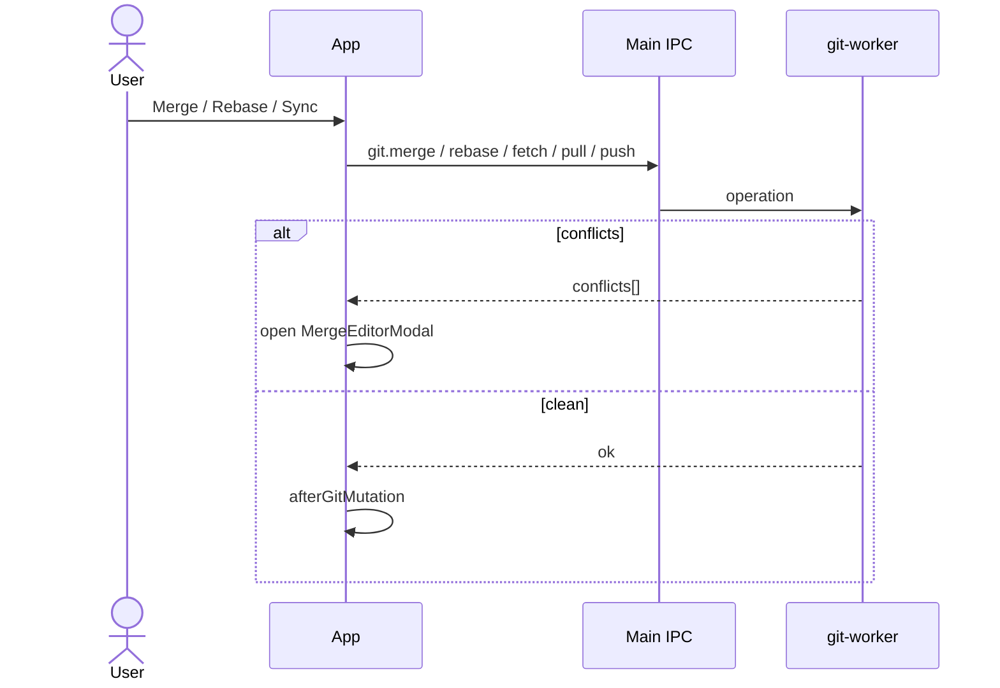

# Feature: Branches & sync

## Purpose

Operate on branches and remotes: checkout (local and remote-tracking), create/delete, fetch/pull/push, merge, and rebase (including continue/abort while rebasing).

## User flow

1. Sidebar shows the current branch and expandable local / remote branch lists with ahead/behind. Every branch can show only its own history or jump to its tip in the history ([History graph](history-graph.md)). The repository list and each branch list are one Tab stop: ↑ / ↓, Home and End move between rows, and Enter opens the repository or checks out the branch.
2. Create branch modal; checkout by double-clicking a branch (or pressing Enter on it); checkout a remote branch via `git:checkout-remote-branch`; delete after confirming, with a second dialog to force delete when Git refuses.
3. Sync menu: Fetch, Pull, Push. It opens with its first item focused; ↑ / ↓ go round the items, and Escape closes it and returns focus to Sync.
4. Merge / Rebase open a branch picker; conflicts open the merge editor.
5. While rebasing, Continue / Skip commit / Abort are available from the merge editor and the Changes pane. While merging (`MERGE_HEAD` exists), Abort merge is available in both, and committing from Changes concludes the merge.

## Key modules & files

| Piece | File |
|---|---|
| Shell / actions | [`src/renderer/src/App.tsx`](../../src/renderer/src/App.tsx), [`RepoSidebar.tsx`](../../src/renderer/src/shell/RepoSidebar.tsx) |
| Create branch | [`src/renderer/src/features/branches/CreateBranchModal.tsx`](../../src/renderer/src/features/branches/CreateBranchModal.tsx) |
| Branch pick (merge/rebase) | [`src/renderer/src/features/branches/BranchPickModal.tsx`](../../src/renderer/src/features/branches/BranchPickModal.tsx) |
| Branch / sync ops | [`src/git-worker/ops/branches.ts`](../../src/git-worker/ops/branches.ts) |
| Git IPC | [`src/main/ipc/git-handlers.ts`](../../src/main/ipc/git-handlers.ts) |

## Data touched

- Refs and branch tip commits
- Upstream tracking (`BranchInfo.ahead` / `behind`)
- Remote-tracking names (`RemoteBranchInfo`)
- Working tree may gain conflicts from merge/rebase
- Rebase state under `.git` (`isRebaseInProgress`)

## Edge cases & rules

- Deleting a branch asks first. When Git refuses because the branch is not fully merged, a second dialog shows Git's reason and offers to force delete. Merging, rebasing and aborting a merge or rebase also ask first.
- Merge/rebase return `{ conflicts: string[] }`; non-empty list opens merge UI.
- Push/pull/fetch require configured remotes and credentials outside the app (SSH agent / credential helper).
- While a fetch, pull or push runs, the toolbar shows Git's current step and percentage with a Cancel button. Cancelling stops Git together with the helpers it started (`git-remote-https`, ssh, the credential manager), so the connection closes; a cancel is not reported as an error.
- A fetch, pull or push that produces no output for 5 minutes (a stalled network, or a sign-in or passphrase prompt nobody can answer) is stopped with a message saying so.
- Pull fetches the branch's remote, then fast-forwards to its upstream. Only the fetch can be cancelled: updating files cannot be interrupted safely. A branch without an upstream, and a branch that has diverged from it, get their own messages.
- Push publishes a branch that has no upstream to `origin` (or the only remote) and sets the upstream. A rejected (non-fast-forward) push explains that the remote has newer commits; the app never force-pushes.
- Checkout runs `git checkout <ref> --`, so a name that is not a ref fails instead of restoring same-named files.
- Refs and branch names that look like options (`--exec=…`) are rejected before reaching Git.

## Diagram

