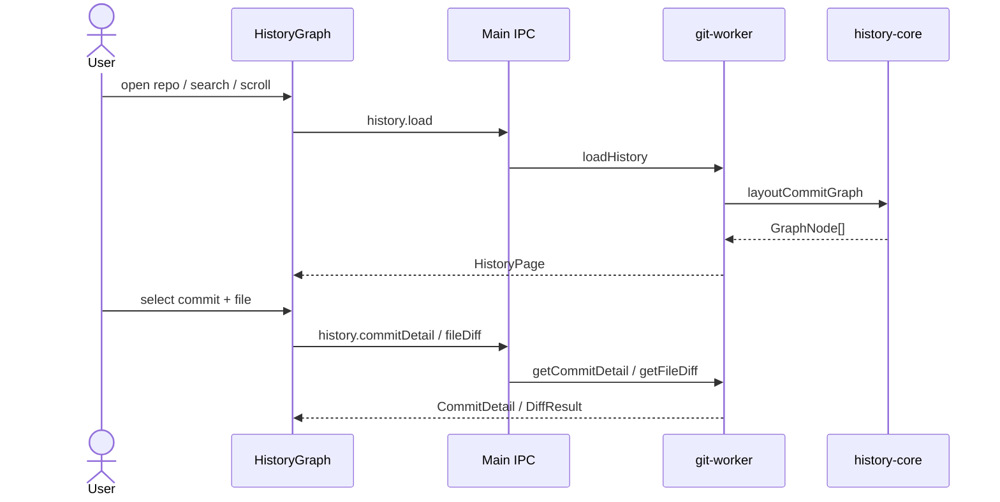

# Feature: History graph

## Purpose

History-first view of commits: a multi-lane topology graph, searchable log, and commit detail with per-file Monaco diffs. This is the default landing view after opening a repository.

## User flow

1. Open a repo → History mode loads the first page (~200 commits). Scroll near the bottom to load older pages (`nextCursor` / `--skip`).
2. Search runs in Git (`--grep` / `--author` / SHA via `rev-parse`), not only against the loaded page. Changing search resets paging.
3. Preference `historyFilter` can limit to the current branch (branch pages use portable `git log --skip`).
4. Click a commit → detail pane lists files and loads the commit body; pick a file → side-by-side diff (blob size probed, text capped for Monaco).
5. Working-copy row / Changes mode switches away from commit selection.

## Performance notes (Windows + macOS)

- List `git log` omits commit bodies; body is loaded only in commit detail.
- History paging uses portable argv (`shell: false`, `LC_ALL=C`) so Apple Xcode CLT Git and Homebrew Git behave like Git for Windows.
- Minimum practical Git: **2.20+** (common on current Apple CLT and Homebrew). Features used: `log --decorate`, `--grep` + `--basic-regexp` + `--regexp-ignore-case`, `cat-file -s`, `status --porcelain=v2`, revision `sha^@`.
- Status defaults to `--untracked-files=normal` (preference `statusUntracked`: `normal` | `all`).
- Git ops prefer an Electron `utilityProcess` worker on **win32 and darwin**, with in-process fallback if the worker cannot start.
- The history list is window-virtualized (fixed 34px rows) so multi-page loads stay responsive on Retina displays.

## Key modules & files

| Piece | File |
|---|---|
| Graph UI (virtualized) | [`src/renderer/src/features/history-graph/HistoryGraph.tsx`](../../src/renderer/src/features/history-graph/HistoryGraph.tsx) |
| Graph cell SVG | [`src/renderer/src/features/history-graph/GraphCell.tsx`](../../src/renderer/src/features/history-graph/GraphCell.tsx) |
| Commit detail | [`src/renderer/src/features/commit-detail/CommitDetailPane.tsx`](../../src/renderer/src/features/commit-detail/CommitDetailPane.tsx) |
| Diff viewer | [`src/renderer/src/features/diff/FileDiffViewer.tsx`](../../src/renderer/src/features/diff/FileDiffViewer.tsx) |
| Lane layout | [`src/history-core/layout.ts`](../../src/history-core/layout.ts) |
| Load / detail / diff | [`src/git-worker/operations.ts`](../../src/git-worker/operations.ts) (`loadHistory`, `getCommitDetail`, `getFileDiff`) |
| Stream parse / capped show | [`src/git-worker/git-runner.ts`](../../src/git-worker/git-runner.ts) |
| Utility process client | [`src/git-worker/client.ts`](../../src/git-worker/client.ts), [`src/git-worker/utility-entry.ts`](../../src/git-worker/utility-entry.ts) |

## Data touched

- Reads: commits, refs, graph nodes, file lists, blob text for diffs
- Does not mutate the repository

## Edge cases & rules

- Binary files return `DiffResult.binary` without text panes.
- Parent index selects which parent to diff against for merges (`DiffRequest.parentIndex`).
- Column widths for graph/date/author are preference-backed and resizable.
- Detail dock is `bottom` or `right` via `AppPreferences.detailDock`.
- After routine mutations (commit, sync), history does a tip merge refresh; topology-changing ops (rebase, merge, checkout, delete branch) reload history fully.

## Diagram

