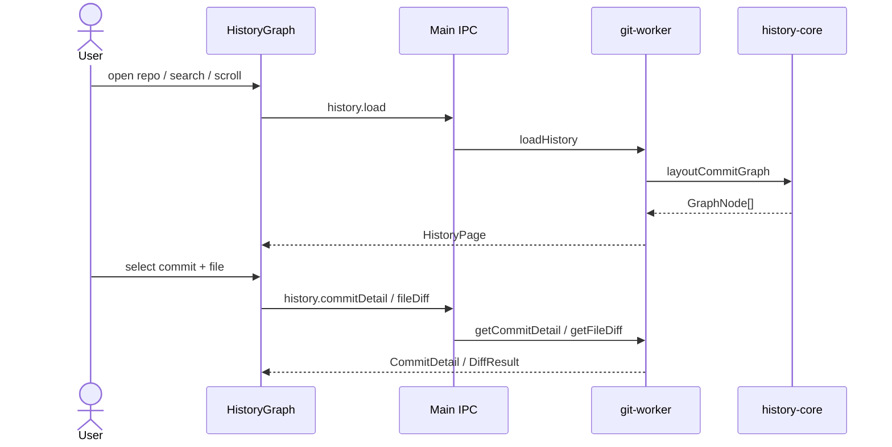

# Feature: History graph

## Purpose

History-first view of commits: a multi-lane topology graph, searchable log, and commit detail with per-file Monaco diffs. This is the default landing view after opening a repository.

## User flow

1. Open a repo → History mode loads the first page (~200 commits). Scroll near the bottom to load older pages: each page is an offset (`--skip`) into one `git log --date-order` walk, so commits of every branch appear, in order.
2. Search runs in Git, not only against the loaded page. Plain text is matched literally and case-insensitively in commit messages (`--fixed-strings --grep`), `author:name` filters by author, and 7–40 hex digits jump to that commit. Submitting a search resets paging; paging and live refreshes keep using the submitted search, not unsubmitted text in the box.
3. `branch:name` limits the list to matching branches and combines with the rest of the search (`branch:main fix login`). A name matches exactly, where `main` also selects `origin/main` and other remotes' `main`; when no branch has that name, every branch whose name contains it matches. `*` and `?` make it a glob (`branch:feature/*`), and several `branch:` words add up. The header names the branches shown; when none matches, the list says so.
4. While typing, the last word of the search suggests matching local and remote branches: ↑/↓ highlight one, Enter shows that branch (`branch:name`), Alt+Enter (Option+Enter on macOS) jumps to its tip, and Escape closes the list. Enter without a highlight searches for the text as typed.
5. Each branch in the sidebar has **Show only this branch** and **Jump to tip**. A jump selects the tip commit and scrolls it into view, loading older pages when needed; the search is cleared first, since it may hide the tip. **Jump to HEAD** in the header does the same for HEAD.
6. Preference `historyFilter` can limit to the current branch (branch pages use portable `git log --skip`). An applied `branch:` search replaces that filter.
7. Click a commit → detail pane lists files and loads the commit body; pick a file → its diff, inline or side by side as in Changes ([Diff view](working-tree.md#diff-view); blob size probed, text capped for Monaco).
8. Working-copy row / Changes mode shows the working tree. Going back to History selects the commit that was selected before when it is still listed (otherwise the newest), without loading its details again.

## Keyboard

| Key | Where | Does |
|---|---|---|
| ↑ / ↓, PageUp / PageDown, Home / End | Commit list | Select another commit; older pages load as the selection nears the end |
| Enter | Commit list | Go to the commit's file list |
| ↑ / ↓, PageUp / PageDown, Home / End | File list | Show another file's diff |
| Escape | File list | Back to the commit list |
| Tab / Shift+Tab | Diff | Leave the read-only diff, like any other control |
| F6 / Shift+F6 | Outside dialogs | Move between the sidebar, the list, the inspector and the search box |
| ← / → | Column edge in the header | Resize the column (Shift: 50 px; Home / End: narrowest / widest) |

Search suggestions have their own keys (step 4 above). The commit list and the file list keep keyboard focus on the list itself and mark the active row with `aria-activedescendant`, so focus survives rows leaving the virtualized list.

## Performance notes (Windows + macOS)

- List `git log` omits commit bodies; body is loaded only in commit detail.
- Commit detail loads 120 ms after the selection stops changing, and a file diff only once that commit's detail has arrived, so holding an arrow key does not run Git for every commit it passes.
- A commit's details never change, so they load once per selection: coming back to the commit or refreshing the list does not run `git show` again.
- History paging uses portable argv (`shell: false`, `LC_ALL=C`) so Apple Xcode CLT Git and Homebrew Git behave like Git for Windows.
- Minimum practical Git: **2.20+** (common on current Apple CLT and Homebrew). Features used: `log --date-order --decorate=full --skip --exclude --stdin`, `--fixed-strings --regexp-ignore-case`, `for-each-ref`, `diff-tree -z -M --root`, `cat-file -s`, `status --porcelain=v2 -z`.
- Git ops run in an Electron `utilityProcess` worker, with in-process fallback if the worker cannot start.
- The history list is window-virtualized (fixed 34px rows) so multi-page loads stay responsive on Retina displays. Scroll updates batch on animation frames and only re-render when the visible row window changes.
- Load-more appends graph lanes from a saved checkpoint in O(page size); tip splice/rewrite still relayouts the full list because the prefix can change. Later pages omit a page-local graph from the worker.
- History list consumers subscribe only to selection core (selected SHA) and history-column layout, so diff loads and sidebar drags do not repaint the graph.

## Key modules & files

| Piece | File |
|---|---|
| Graph UI (virtualized) | [`src/renderer/src/features/history-graph/HistoryGraph.tsx`](../../src/renderer/src/features/history-graph/HistoryGraph.tsx) |
| Graph cell SVG | [`src/renderer/src/features/history-graph/GraphCell.tsx`](../../src/renderer/src/features/history-graph/GraphCell.tsx) |
| Search box and branch suggestions | [`src/renderer/src/shell/HistorySearchBox.tsx`](../../src/renderer/src/shell/HistorySearchBox.tsx), [`src/renderer/src/logic/branch-suggest.ts`](../../src/renderer/src/logic/branch-suggest.ts) |
| `branch:` parsing and matching | [`src/shared/branch-search.ts`](../../src/shared/branch-search.ts) |
| Commit detail | [`src/renderer/src/features/commit-detail/CommitDetailPane.tsx`](../../src/renderer/src/features/commit-detail/CommitDetailPane.tsx) |
| Diff viewer, Inline / Side by side switch and syntax colors | [`src/renderer/src/features/diff/FileDiffViewer.tsx`](../../src/renderer/src/features/diff/FileDiffViewer.tsx), [`src/renderer/src/features/diff/DiffViewSwitch.tsx`](../../src/renderer/src/features/diff/DiffViewSwitch.tsx), [`src/renderer/src/features/diff/SyntaxHighlightToggle.tsx`](../../src/renderer/src/features/diff/SyntaxHighlightToggle.tsx) |
| Lane layout | [`src/history-core/layout.ts`](../../src/history-core/layout.ts) |
| History state, jumps | [`src/renderer/src/hooks/useHistory.ts`](../../src/renderer/src/hooks/useHistory.ts), [`src/renderer/src/state/HistoryProvider.tsx`](../../src/renderer/src/state/HistoryProvider.tsx) |
| Load / detail / diff | [`src/git-worker/ops/history.ts`](../../src/git-worker/ops/history.ts) |
| Stream parse / capped show | [`src/git-worker/git-runner.ts`](../../src/git-worker/git-runner.ts) |
| Utility process client | [`src/git-worker/client.ts`](../../src/git-worker/client.ts), [`src/git-worker/utility-entry.ts`](../../src/git-worker/utility-entry.ts) |
| History IPC | [`src/main/ipc/history-handlers.ts`](../../src/main/ipc/history-handlers.ts) |

## Data touched

- Reads: commits, refs, graph nodes, file lists, blob text for diffs
- Does not mutate the repository

## Edge cases & rules

- Binary files return `DiffResult.binary` without text panes.
- Lane layout frees every lane that ends at a commit, so the graph is only as wide as the number of branches open at a row. Each `GraphNode` lists the lines passing through, joining at, and leaving its row.
- Stash entries are not shown under All branches (`--exclude=refs/stash`).
- The first commit lists its files; renames show their old path and are diffed against it.
- Each file has a status dot coloured as in Changes ([Brandbook](../brandbook.md#file-status)); hover it for the status and, for a rename or copy, the path it came from.
- When history was rewritten (amend, rebase, reset, pruned branches), a tip refresh replaces the list instead of splicing new commits above stale ones.
- With **Current branch**, switching branches reloads the list once. Each list belongs to its repository and filter: results that arrive after a switch are dropped, and a list that is already loading is not requested again.
- The branches a `branch:` search matches are passed to `git log --stdin` by full ref name, so a pattern that matches thousands of branches stays within command-line limits, and a local branch named like a remote one (`origin/x`) is not confused with it. A remote's `HEAD` pointer is never matched.
- A jump reads at most 10,000 commits looking for its commit, then returns everything down to it plus one more page (`HistoryQuery.revealSha`, `HistoryPage.revealed`). A branch tip further down, or outside the **Current branch** filter, is shown by switching to that branch's history (`branch:name`) with a note in the header.
- Parent index selects which parent to diff against for merges (`DiffRequest.parentIndex`).
- Column widths for graph/date/author are preference-backed and resizable.
- Detail dock is `bottom` or `right` via `AppPreferences.detailDock`.
- Diffs follow `AppPreferences.diffView` and `AppPreferences.syntaxHighlighting`, shared with Changes, in either dock.
- The inspector never gets wider than its dock. A narrow header wraps: the commit's buttons move to a row of their own. Docked right, the file list narrows before the diff, which keeps room for its Inline / Side by side switch.
- After routine mutations (commit, sync), history does a tip merge refresh; topology-changing ops (rebase, merge, checkout, delete branch) reload history fully.

## Diagram

