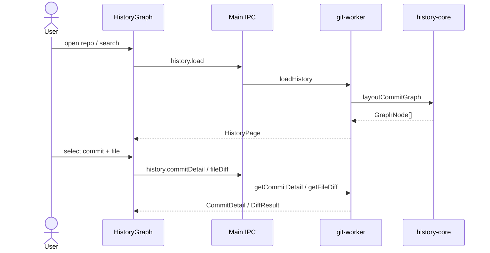

# Feature: History graph

## Purpose

History-first view of commits: a multi-lane topology graph, searchable log, and commit detail with per-file Monaco diffs. This is the default landing view after opening a repository.

## User flow

1. Open a repo → History mode loads up to ~300 commits (cursor available in the schema for paging).
2. Optional search filters the log; preference `historyFilter` can limit to the current branch.
3. Click a commit → detail pane lists files; pick a file → side-by-side diff.
4. Working-copy row / Changes mode switches away from commit selection.

## Key modules & files

| Piece | File |
|---|---|
| Graph UI | [`src/renderer/src/features/history-graph/HistoryGraph.tsx`](../../src/renderer/src/features/history-graph/HistoryGraph.tsx) |
| Graph cell SVG | [`src/renderer/src/features/history-graph/GraphCell.tsx`](../../src/renderer/src/features/history-graph/GraphCell.tsx) |
| Commit detail | [`src/renderer/src/features/commit-detail/CommitDetailPane.tsx`](../../src/renderer/src/features/commit-detail/CommitDetailPane.tsx) |
| Diff viewer | [`src/renderer/src/features/diff/FileDiffViewer.tsx`](../../src/renderer/src/features/diff/FileDiffViewer.tsx) |
| Lane layout | [`src/history-core/layout.ts`](../../src/history-core/layout.ts) |
| Load / detail / diff | [`src/git-worker/operations.ts`](../../src/git-worker/operations.ts) (`loadHistory`, `getCommitDetail`, `getFileDiff`) |

## Data touched

- Reads: commits, refs, graph nodes, file lists, blob text for diffs
- Does not mutate the repository

## Edge cases & rules

- Binary files return `DiffResult.binary` without text panes.
- Parent index selects which parent to diff against for merges (`DiffRequest.parentIndex`).
- Column widths for graph/date/author are preference-backed and resizable.
- Detail dock is `bottom` or `right` via `AppPreferences.detailDock`.

## Diagram

