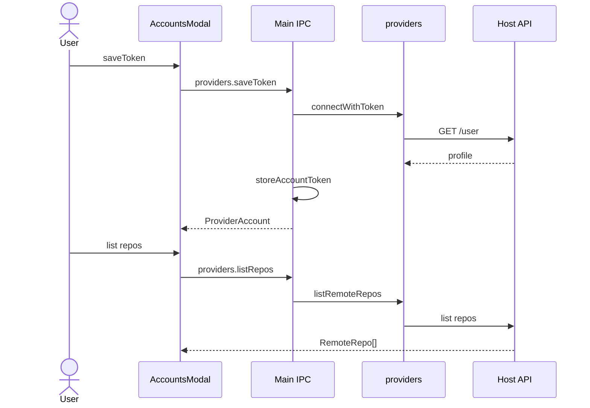

# Feature: Host accounts

## Purpose

Connect GitHub or GitLab (GitLab.com or a self-managed instance) with a personal access token, or Bitbucket with an Atlassian API token and account email; list remote repositories and feed clone URLs into the clone flow. An optional separate OAuth broker exists for confidential-client flows; the desktop app connects via `providers:save-token`.

## User flow

1. Open Accounts modal → choose provider → paste token. For a self-managed GitLab, also enter its address (for example `https://gitlab.example.com`); leave it empty for GitLab.com. Bitbucket also needs the Atlassian account email; API calls use HTTP Basic auth with email + API token.
2. Token is validated against the host `/user` API (`<address>/api/v4/user` for GitLab); account metadata is stored; token encrypted at rest.
3. List remote repos for the selected account; pick one to clone (HTTPS or SSH URL).
4. Disconnect removes the account record (and encrypted token).

## Key modules & files

| Piece | File |
|---|---|
| Accounts UI | [`src/renderer/src/features/accounts/AccountsModal.tsx`](../../src/renderer/src/features/accounts/AccountsModal.tsx) |
| Provider REST | [`src/main/providers/index.ts`](../../src/main/providers/index.ts) |
| GitLab address and API | [`src/main/providers/gitlab.ts`](../../src/main/providers/gitlab.ts) |
| Requests and paging | [`src/main/providers/http.ts`](../../src/main/providers/http.ts) |
| Token storage | [`src/main/storage.ts`](../../src/main/storage.ts) |
| IPC | [`src/main/ipc/providers-handlers.ts`](../../src/main/ipc/providers-handlers.ts) (`providers:*`) |
| OAuth broker | [`services/oauth-broker/server.ts`](../../services/oauth-broker/server.ts) |

## Data touched

- `accounts.json` (`ProviderAccount` + `tokenEnc`)
- Host REST APIs (user + repos)
- Clone creates a local `Repository`

## Edge cases & rules

- Desktop IPC exposes `listAccounts`, `saveToken`, `disconnect`, and `listRepos` only — no in-app OAuth code exchange yet (use the optional broker for confidential clients).
- Listed accounts never include plaintext tokens (or the stored Bitbucket email) over IPC.
- A GitLab address may be typed as `gitlab.example.com`, `https://example.com/gitlab/` or with `/api/v4`; it is saved as `https://host[:port][/path]` in `ProviderAccount.baseUrl`. Only `https://` is accepted, because the token goes with every request, and an address with a user name, password, `?` or `#` is refused.
- An account on a self-managed instance gets an id that includes the instance (`gitlab:<host>:<user id>`), so equal user ids on different instances stay separate accounts. GitLab.com accounts keep `gitlab:<user id>` and have no `baseUrl`. The Connected list shows the instance for self-managed accounts.
- Repository lists follow pagination up to 10 pages (1,000 repositories); each host request times out after 20 seconds. Paging links (the `Link` header, Bitbucket's `next`) are followed only while they stay on the API's origin (scheme, host and port), so a token is never sent to another host.
- Bitbucket accounts saved without an email (app-password era) must be reconnected.
- Without OS encryption (`safeStorage` unavailable, or the Linux `basic_text` backend), tokens are stored base64-encoded and the account is marked "token stored without OS encryption" in the Accounts dialog.
- Broker does not store long-lived user tokens; it only exchanges codes.

## Diagram

