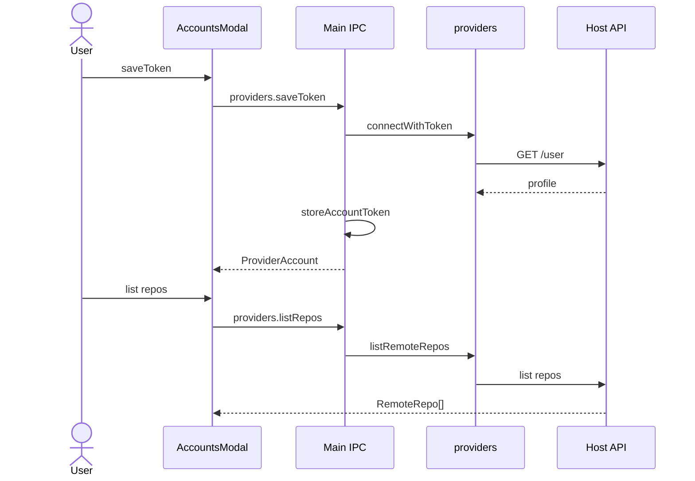

# Feature: Host accounts

## Purpose

Connect GitHub, GitLab, or Bitbucket with a personal access token (or app password), list remote repositories, and feed clone URLs into the clone flow. Optional separate OAuth broker exists for confidential-client flows; v1 desktop connect uses token save.

## User flow

1. Open Accounts modal → choose provider → paste token (Bitbucket may need username).
2. Token is validated against the host `/user` API; account metadata is stored; token encrypted at rest.
3. List remote repos for the selected account; pick one to clone (HTTPS or SSH URL).
4. Disconnect removes the account record (and encrypted token).

## Key modules & files

| Piece | File |
|---|---|
| Accounts UI | [`src/renderer/src/features/accounts/AccountsModal.tsx`](../../src/renderer/src/features/accounts/AccountsModal.tsx) |
| Provider REST | [`src/main/providers/index.ts`](../../src/main/providers/index.ts) |
| Token storage | [`src/main/storage.ts`](../../src/main/storage.ts) |
| IPC | [`src/main/ipc.ts`](../../src/main/ipc.ts) (`providers:*`) |
| OAuth broker | [`services/oauth-broker/server.ts`](../../services/oauth-broker/server.ts) |

## Data touched

- `accounts.json` (`ProviderAccount` + `tokenEnc`)
- Host REST APIs (user + repos)
- Clone creates a local `Repository`

## Edge cases & rules

- `providers.connect` currently throws and directs callers to token connect / oauth-broker ([`ipc.ts`](../../src/main/ipc.ts)).
- Listed accounts never include plaintext tokens over IPC.
- If `safeStorage` is unavailable, tokens fall back to base64 encoding (weaker) — same helpers still used.
- Broker does not store long-lived user tokens; it only exchanges codes.

## Diagram

