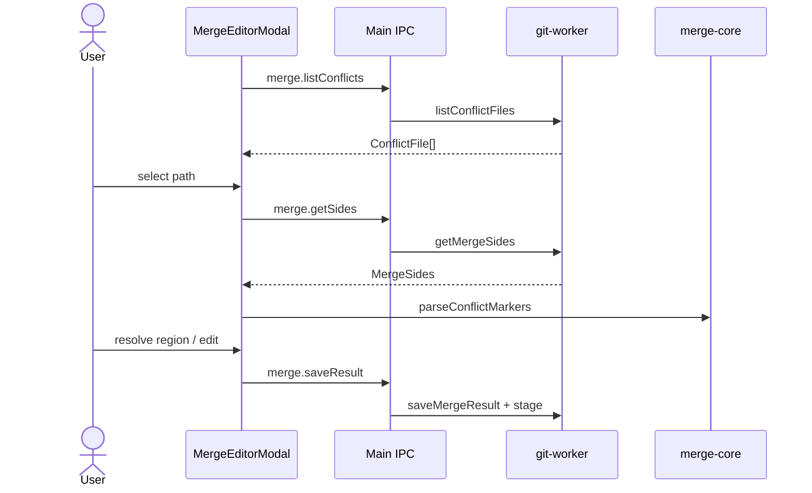

# Feature: Merge editor

## Purpose

Resolve merge and rebase conflicts with a VS Code-style flow: list conflicted files, show three-way sides, parse conflict markers into regions, choose ours/theirs/both or edit manually, then stage the result.

## User flow

1. Merge/rebase leaves conflicts, or status already has conflicted paths → modal opens.
2. Select a conflicted file; the result buffer is the work-tree file Git produced — non-overlapping changes from both sides are already merged and markers remain only around real conflicts.
3. Resolve each region or edit the Monaco buffer; Save stages the file. **Take ours / Take theirs** resolves the whole file instead (for a modify/delete conflict, taking the deleting side removes the file).
4. If rebasing: **Continue rebase**, **Skip commit**, or **Abort rebase** from the modal. If merging: **Abort merge** here, or commit from Changes to finish the merge (allowed even when the resolution changes nothing).

## Key modules & files

| Piece | File |
|---|---|
| Modal UI | [`src/renderer/src/features/merge-editor/MergeEditorModal.tsx`](../../src/renderer/src/features/merge-editor/MergeEditorModal.tsx) |
| Marker parse / resolve | [`src/merge-core/conflict.ts`](../../src/merge-core/conflict.ts) |
| Git sides + save | [`src/git-worker/ops/merge.ts`](../../src/git-worker/ops/merge.ts) |
| Merge IPC | [`src/main/ipc/merge-handlers.ts`](../../src/main/ipc/merge-handlers.ts) |

## Data touched

- Unmerged index stages (base/ours/theirs)
- Working tree file content for the conflicted path
- Staging area after save

## Edge cases & rules

- Files may lack base/ours/theirs stages (`ConflictFile` flags); UI still loads available sides.
- `hasUnresolvedMarkers` blocks treating a file as done when markers remain.
- Binary files and files over 8 MB are not shown as text; resolve them with Take ours / Take theirs (`merge:resolve-side`).
- Regions are re-parsed from the result text on every edit, and the file's line endings (LF / CRLF) are preserved.
- The three panes show syntax colors for the file's language, like diffs (`AppPreferences.syntaxHighlighting`, the palette button in the toolbar). A file whose ours, theirs or result text is over 1 MB stays plain, and the toolbar says so: coloring three such panes would keep the main thread busy for seconds. Whether a file is colored is decided when it loads, never while the result is edited.

## Diagram

