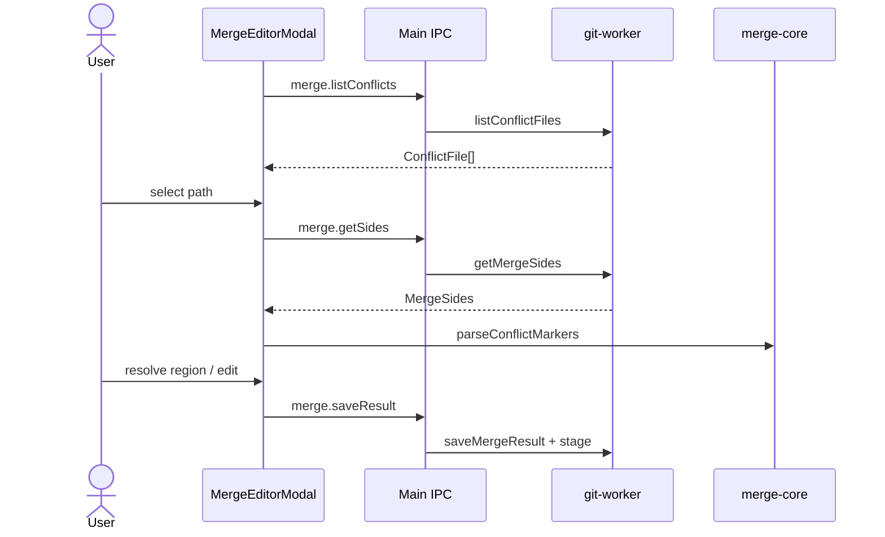

# Feature: Merge editor

## Purpose

Resolve merge and rebase conflicts with a VS Code-style flow: list conflicted files, show three-way sides, parse conflict markers into regions, choose ours/theirs/both or edit manually, then stage the result.

## User flow

1. Merge/rebase leaves conflicts, or status already has conflicted paths → modal opens (nearly full window).
2. Select a conflicted file (a row of buttons, or a column beside the editors when there are more than four); each shows its conflicts left, and files saved in this session stay listed with a check. The result buffer is the work-tree file Git produced — non-overlapping changes from both sides are already merged and markers remain only around real conflicts. The editor jumps to the first conflict.
3. Find conflicts: they are colored in every pane (ours green, theirs blue, base grey, markers red) and marked on each scrollbar; lines each side changed from the base are tinted lightly. **‹ / ›** or **F7 / Shift+F7** move between conflicts and scroll every pane to it. With **Scroll together** on (default), scrolling any pane scrolls the others to the matching lines.
4. Resolve: the toolbar pinned at the active conflict offers **Accept ours / Accept theirs / Both / Both, theirs first**; the main toolbar has the same for the conflict under the cursor. Each resolution is one Ctrl+Z step; **Start over** goes back to Git's merge. Or edit the result directly. Save stages the file and opens the next one; leaving a file with unsaved changes asks first. **Take ours / Take theirs** resolves the whole file instead (for a modify/delete conflict, taking the deleting side removes the file).
5. If rebasing: **Continue rebase**, **Skip commit**, or **Abort rebase** from the modal. If merging: **Abort merge** here, or commit from Changes to finish the merge (allowed even when the resolution changes nothing).

Layout: **Columns** (ours | result | theirs) or **Stacked** (ours and theirs above a full-width result), saved as `AppPreferences.mergeEditorLayout`. **Base** adds the common ancestor as a fourth pane, with the lines each side replaced colored.

## Key modules & files

| Piece | File |
|---|---|
| Modal UI | [`src/renderer/src/features/merge-editor/MergeEditorModal.tsx`](../../src/renderer/src/features/merge-editor/MergeEditorModal.tsx) |
| Conflict colors / inline toolbar | [`merge-decorations.ts`](../../src/renderer/src/features/merge-editor/merge-decorations.ts), [`merge-conflict-actions.ts`](../../src/renderer/src/features/merge-editor/merge-conflict-actions.ts) |
| Pane line matching (scrolling together) | [`src/renderer/src/logic/merge-scroll.ts`](../../src/renderer/src/logic/merge-scroll.ts) |
| Marker parse / locate / resolve | [`src/merge-core/conflict.ts`](../../src/merge-core/conflict.ts) |
| Git sides + save | [`src/git-worker/ops/merge.ts`](../../src/git-worker/ops/merge.ts) |
| Merge IPC | [`src/main/ipc/merge-handlers.ts`](../../src/main/ipc/merge-handlers.ts) |

## Data touched

- Unmerged index stages (base/ours/theirs)
- Working tree file content for the conflicted path
- Staging area after save

## Edge cases & rules

- Files may lack base/ours/theirs stages (`ConflictFile` flags); UI still loads available sides.
- `hasUnresolvedMarkers` blocks treating a file as done when markers remain.
- Binary files and files over 8 MB are not shown as text; resolve them with Take ours / Take theirs (`merge:resolve-side`).
- Regions are re-parsed from the result text on every edit, and the file's line endings (LF / CRLF) are preserved: the panes mount only once the file is loaded, and the result model's EOL is set from the file (Monaco would otherwise default an empty model to CRLF on Windows).
- Each conflict is found in the ours / theirs files by searching for its side's lines after the previous conflict's match (`locateRegions`); a side with no lines is placed after the line above the conflict. Panes scroll together by mapping lines piecewise between those blocks.
- Lines changed from the base come from `git diff -U0 :1:<path> :2:<path>` (and `:3:`) in the worker (`MergeSides.oursChanges` / `theirsChanges`); left out without a base or above 1 MB, like syntax colors.
- The three panes show syntax colors for the file's language, like diffs (`AppPreferences.syntaxHighlighting`, the palette button in the toolbar). A file whose ours, theirs or result text is over 1 MB stays plain, and the toolbar says so: coloring three such panes would keep the main thread busy for seconds. Whether a file is colored is decided when it loads, never while the result is edited.

## Diagram

