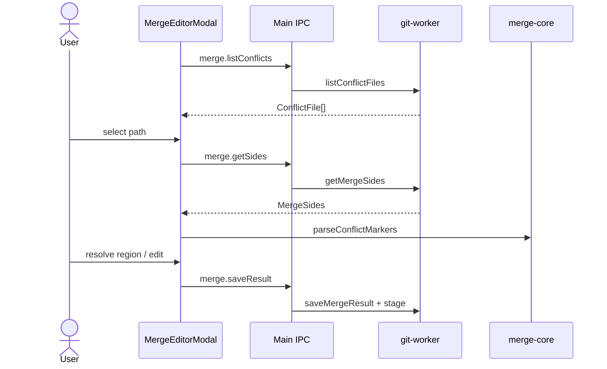

# Feature: Merge editor

## Purpose

Resolve merge and rebase conflicts with a VS Code-style flow: list conflicted files, show three-way sides, parse conflict markers into regions, choose ours/theirs/both or edit manually, then stage the result.

## User flow

1. Merge/rebase leaves conflicts, or status already has conflicted paths → modal opens.
2. Select a conflicted file; result buffer loads (markers or synthesized content).
3. Resolve each region or edit the Monaco buffer; Save stages the file.
4. If rebasing: Continue or Abort from the modal.

## Key modules & files

| Piece | File |
|---|---|
| Modal UI | [`src/renderer/src/features/merge-editor/MergeEditorModal.tsx`](../../src/renderer/src/features/merge-editor/MergeEditorModal.tsx) |
| Marker parse / resolve | [`src/merge-core/conflict.ts`](../../src/merge-core/conflict.ts) |
| Git sides + save | [`src/git-worker/operations.ts`](../../src/git-worker/operations.ts) (`listConflictFiles`, `getMergeSides`, `saveMergeResult`) |

## Data touched

- Unmerged index stages (base/ours/theirs)
- Working tree file content for the conflicted path
- Staging area after save

## Edge cases & rules

- Files may lack base/ours/theirs stages (`ConflictFile` flags); UI still loads available sides.
- `hasUnresolvedMarkers` blocks treating a file as done when markers remain.
- Binary / unusual encodings: _TBD_ — confirm behavior if non-text conflicts appear in practice.

## Diagram

