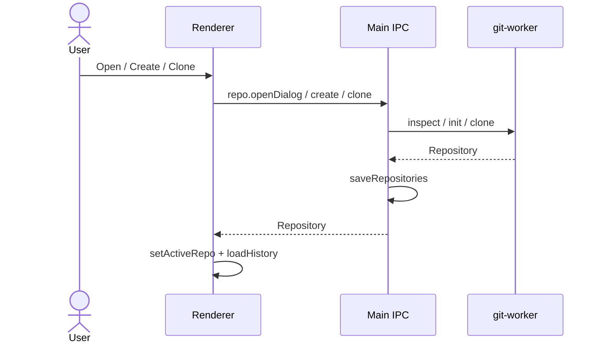

# Feature: Repository management

## Purpose

Keep a list of local repositories the user works with: open existing folders, create new repos, clone from URL or host listings, and remove entries from the app (without deleting disk content unless Git clone creates them).

## User flow

1. Empty state or sidebar: **Open**, **Create**, or **Clone**.
2. Open uses a native directory dialog; Create runs `git init` then adds the path; Clone asks for URL, target directory, and HTTPS/SSH.
3. Selecting a repo in the sidebar makes it active — History loads by default (or Changes if there is no HEAD yet).
4. Removing a repo drops it from `repositories.json` only.

## Key modules & files

| Piece | File |
|---|---|
| App coordinator | [`src/renderer/src/App.tsx`](../../src/renderer/src/App.tsx) |
| Welcome / sidebar | [`src/renderer/src/shell/WelcomeScreen.tsx`](../../src/renderer/src/shell/WelcomeScreen.tsx), [`RepoSidebar.tsx`](../../src/renderer/src/shell/RepoSidebar.tsx) |
| Repo session hook | [`src/renderer/src/hooks/useRepoSession.ts`](../../src/renderer/src/hooks/useRepoSession.ts) |
| Clone modal | [`src/renderer/src/features/clone/CloneModal.tsx`](../../src/renderer/src/features/clone/CloneModal.tsx) |
| IPC | [`src/main/ipc/repo-handlers.ts`](../../src/main/ipc/repo-handlers.ts) |
| Inspect / init / clone | [`src/git-worker/ops/repo.ts`](../../src/git-worker/ops/repo.ts) |
| Persistence | [`src/main/storage.ts`](../../src/main/storage.ts) |

## Data touched

- `Repository` list in `repositories.json`
- On-disk `.git` via init/clone
- Optional `RemoteRepo` URLs when cloning from Accounts

## Edge cases & rules

- Invalid or non-Git paths fail at inspect time with an error banner.
- Clone transport is `https` or `ssh` ([`CloneRequestSchema`](../../src/shared/ipc/schemas.ts)).
- `pickDirectory` is shared for clone target selection.
- Missing system Git: startup calls `git.probe` ([`probeGit`](../../src/git-worker/git-runner.ts)). When unavailable, the welcome screen shows an install banner, **Add** / **Clone** stay disabled, and a button opens https://git-scm.com/downloads. Spawn `ENOENT` (and macOS Xcode CLT stub failures) map to the same install message. Accounts remain usable without the Git CLI.

## Diagram

