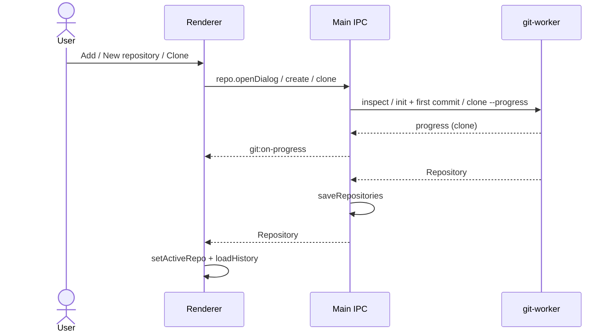

# Feature: Repository management

## Purpose

After creating or opening a local repository, use [Remotes & publishing](remotes-and-publishing.md) to add a remote URL and publish its branch to an existing server repository.

Keep a list of local repositories the user works with: add existing folders, create new repositories, clone from a URL or a host listing, and remove entries from the app, optionally moving the repository folder to the Trash.

## User flow

On launch, the app restores its last maximized/full-screen mode before showing the window. Saved repositories load behind a neutral **Opening repositories…** view, then the first saved repository opens. The welcome screen with Add/New/Clone appears only after the saved list has loaded successfully and is empty. **View → Toggle Full Screen**, or F11, switches full-screen mode.

1. Welcome screen or File menu: **Add local repository**, **New repository** (File → New Repository…, Ctrl+N or ⌘N) or **Clone repository**.
2. Add uses a native folder dialog; a folder inside a work tree adds that work tree's root.
3. New repository asks for a name, a location (Documents until another is chosen), the initial branch (Git's `init.defaultBranch`, else `main`) and whether to add a README.md with a first commit (on by default). The location is checked while typing, and the dialog shows the folder it will create or why it cannot. Creating runs `git init`, points HEAD at the initial branch, commits README.md, then adds the repository and opens it.
4. Clone asks for a URL (HTTPS or SSH) and a parent folder and shows the folder it clones into. While cloning, the dialog shows Git's current step and percentage; **Cancel clone** stops Git and removes the partly cloned folder. A finished clone is added and opened.
5. Selecting a repo in the sidebar makes it active — History loads by default (or Changes if there is no HEAD yet).
6. Removing a repo (the trash icon on its sidebar row) drops it from `repositories.json`. With **Also move the repository folder to the Trash** checked, the dialog first reports uncommitted changes, stashes and unpushed commits (typing the repository name is required when any exist), then moves the folder to the Recycle Bin / Trash — never a permanent delete. For a linked worktree only uncommitted changes count: its commits, branches and stashes stay in the main repository.
7. For a linked worktree whose folder goes to the Trash or is already gone, **Also remove it from the worktrees of …** (on by default) removes Git's record of that worktree from its main repository, so `git worktree list` there stops showing it.

## Key modules & files

| Piece | File |
|---|---|
| App coordinator | [`src/renderer/src/App.tsx`](../../src/renderer/src/App.tsx) |
| Welcome / sidebar | [`src/renderer/src/shell/WelcomeScreen.tsx`](../../src/renderer/src/shell/WelcomeScreen.tsx), [`RepoSidebar.tsx`](../../src/renderer/src/shell/RepoSidebar.tsx) |
| Startup loading and retry | [`StartupScreen.tsx`](../../src/renderer/src/shell/StartupScreen.tsx), [`startup-view.ts`](../../src/renderer/src/logic/startup-view.ts) |
| Window mode restoration | [`window-state.ts`](../../src/main/window-state.ts), [`index.ts`](../../src/main/index.ts) |
| Repo session hook | [`src/renderer/src/hooks/useRepoSession.ts`](../../src/renderer/src/hooks/useRepoSession.ts) |
| New repository dialog | [`src/renderer/src/features/repositories/NewRepoModal.tsx`](../../src/renderer/src/features/repositories/NewRepoModal.tsx) |
| Clone dialog | [`src/renderer/src/features/clone/CloneModal.tsx`](../../src/renderer/src/features/clone/CloneModal.tsx) |
| Remove dialog | [`src/renderer/src/features/repositories/RemoveRepoDialog.tsx`](../../src/renderer/src/features/repositories/RemoveRepoDialog.tsx) |
| IPC | [`src/main/ipc/repo-handlers.ts`](../../src/main/ipc/repo-handlers.ts) |
| Name and location checks | [`src/shared/repo-name.ts`](../../src/shared/repo-name.ts), [`src/main/new-repo.ts`](../../src/main/new-repo.ts) |
| Inspect / create / clone | [`src/git-worker/ops/repo.ts`](../../src/git-worker/ops/repo.ts) |
| What removal would lose | [`src/git-worker/ops/removal.ts`](../../src/git-worker/ops/removal.ts) |
| Worktrees | [`src/git-worker/ops/worktrees.ts`](../../src/git-worker/ops/worktrees.ts) |
| Clone progress and cancel | [`src/main/remote-ops.ts`](../../src/main/remote-ops.ts) |
| Persistence | [`src/main/storage.ts`](../../src/main/storage.ts) |

## Data touched

- `Repository` list in `repositories.json`
- Maximized/full-screen flags in `userData/state/window.json`; minimizing does not replace the saved maximized mode
- On-disk `.git` via init/clone; README.md and the first commit of a new repository
- The main repository's record of a removed worktree (`.git/worktrees/<id>`)
- Optional `RemoteRepo` URLs when cloning from Accounts

## Edge cases & rules

- Invalid or non-Git paths fail at inspect time with an error banner.
- A new repository's name must work as a folder name on Windows, macOS and Linux: none of `< > : " / \ | ? *` or control characters, no space at either end, no trailing dot, not only dots, and not a Windows device name such as `CON` or `COM1` ([`repo-name.ts`](../../src/shared/repo-name.ts)). The location must be the full path of an existing folder, and the repository folder must be missing or empty ([`new-repo.ts`](../../src/main/new-repo.ts)). Both are checked again when **Create repository** is pressed.
- A location inside another repository is allowed, with a warning: that repository lists the new one as untracked files unless it ignores the folder.
- The initial branch must be a valid branch name (`git check-ref-format --branch`). HEAD is pointed at it with `git symbolic-ref`, which works with every Git version (`git init -b` needs Git 2.28).
- If `git init` fails, what it created is removed. If only the first commit fails — usually because Git has no name and email yet — the repository is kept and opened with README.md staged, and the dialog explains why and offers **Set Git identity…**.
- Clone takes an HTTPS or SSH URL ([`CloneRequestSchema`](../../src/shared/ipc/schemas.ts)), passed to Git after `--` so it is never read as an option. The folder is named the way Git would name it (`…/repo.git/` → `repo`, [`clone-target.ts`](../../src/shared/clone-target.ts)) and must be missing or empty. Like fetch and push, a clone that produces no output for 5 minutes is stopped. A cancelled or failed clone removes its partial folder, or empties it again if it already existed.
- `pickDirectory` is shared by clone and new repository.
- Moving a folder to the Trash is refused for filesystem roots, the home folder or any folder containing it, the app's data and install folders, and anything that is not a Git repository root ([`repo-removal.ts`](../../src/main/repo-removal.ts)). Only git processes running inside that repository are cancelled first.
- Moving a main repository to the Trash while linked worktrees still use it warns that they will stop working, and asks for the repository name.
- A linked worktree records its main repository while its folder exists (`Repository.worktreeOf`), so its record can still be removed after the folder is gone. Only that worktree's record goes: `git worktree prune` would drop every missing worktree, but other worktrees' folders may only be unavailable for now (an unmounted drive, say). The record stays while the worktree is locked, or while its detached HEAD holds commits that no branch, tag or remote contains, since those commits would be lost with it; the dialog then says what to run. Either way the repository is off the list.
- Startup errors show a failure message with **Retry**, rather than treating an unread repository list as empty. Removing the last repository returns to the welcome screen.
- Missing system Git: startup calls `git.probe` ([`probeGit`](../../src/git-worker/git-runner.ts)). Saved repositories stay on file; an install prompt with **Retry** appears instead of repository setup. If the saved list is empty, the welcome screen shows the install banner, **Add local repository**, **New repository** and **Clone repository** stay disabled, and a button opens https://git-scm.com/downloads. Spawn `ENOENT` (and macOS Xcode CLT stub failures) map to the same install message. Accounts remain usable without the Git CLI.

## Diagram

