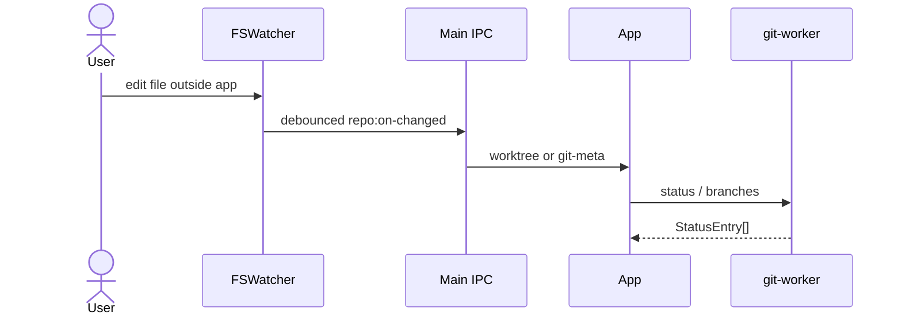

# Feature: Working tree & commits

## Purpose

Inspect and mutate the working tree: stage/unstage, discard, stash, commit (including amend), and set Git author identity used for new commits.

## User flow

1. Switch to **Changes** (or select the working-copy row).
2. Browse staged / unstaged / untracked lists; open a file for staged or unstaged Monaco diff.
3. Stage paths, write a message, Commit (optional Amend).
4. Stash panel: stash (includes untracked), apply / pop / drop entries.
5. Identity modal: set `user.name` / `user.email` at local or global scope.

## Live status

When preference `liveStatusWatch` is enabled (default), the main process recursively watches the active repository with Node `fs.watch({ recursive: true })` (Windows and macOS). Debounced events refresh status/branches; changes under `.git` (index, HEAD, refs, merge/rebase state) also tip-refresh history. Noisy paths (`node_modules`, `.git/objects`, editor temps, etc.) are ignored.

| Piece | File |
|---|---|
| Watcher | [`src/main/repo-watcher.ts`](../../src/main/repo-watcher.ts) |
| IPC | `repo:watch` / `repo:unwatch` / `repo:on-changed` |
| UI subscription | [`src/renderer/src/App.tsx`](../../src/renderer/src/App.tsx) |

## Key modules & files

| Piece | File |
|---|---|
| Changes pane | [`src/renderer/src/features/changes/WorkingTreeDetailPane.tsx`](../../src/renderer/src/features/changes/WorkingTreeDetailPane.tsx) |
| Identity modal | [`src/renderer/src/features/identity/IdentityModal.tsx`](../../src/renderer/src/features/identity/IdentityModal.tsx) |
| Status / stage / commit / stash / identity | [`src/git-worker/operations.ts`](../../src/git-worker/operations.ts) |
| IPC surface | [`src/shared/ipc/channels.ts`](../../src/shared/ipc/channels.ts) (`git:*`, `history:working-tree-diff`) |

## Data touched

- Index and working tree via Git
- Stash reflog
- Local/global Git config for identity
- Reads `StatusEntry`, `DiffResult`, `StashEntry`, `GitIdentity`
- Filesystem notifications for the active repo (when live watch is on)

## Edge cases & rules

- Discard is destructive for unstaged/untracked paths — UI should confirm where appropriate.
- Conflicted paths surface in status and typically open the merge editor from the shell.
- Empty repo (no HEAD) forces Changes view after history load.
- Identity email must be a valid email when setting via `SetGitIdentityRequestSchema`.
- Commit with an empty index shows guidance to Stage / Stage all (not raw `git commit` stderr); amend without staged changes is still allowed for message-only amends.
- Live watch is paused when `liveStatusWatch` is false or no repo is active.

## Diagram

