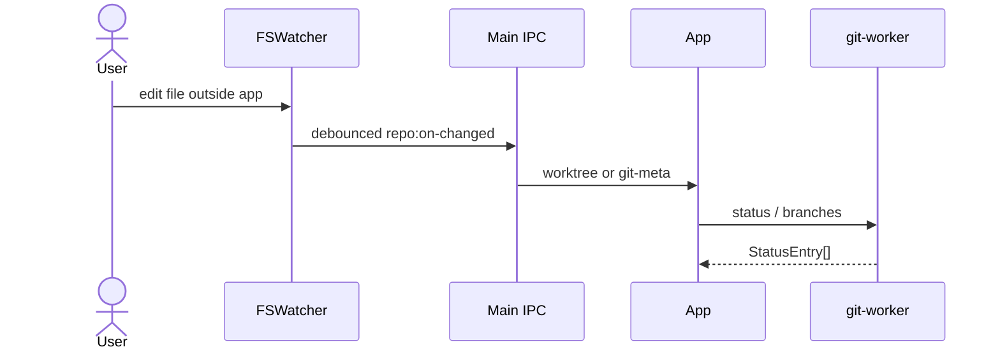

# Feature: Working tree & commits

## Purpose

Inspect and mutate the working tree: stage/unstage, discard, stash, commit (including amend), and set Git author identity used for new commits.

## User flow

1. Switch to **Changes** (or select the working-copy row).
2. Browse staged / unstaged / untracked lists; open a file for staged or unstaged Monaco diff.
3. Stage paths, write a message, Commit (optional Amend).
4. Stash panel: stash (includes untracked), apply / pop / drop entries.
5. Identity modal: set `user.name` / `user.email` at local or global scope.

## Keyboard

- The file list is one Tab stop. ↑ / ↓, PageUp / PageDown, Home and End move through the staged files and then the other changes (as far as their sections are expanded) and show each diff. Space checks or unchecks the active file for Stage, Unstage and Discard.
- Tab leaves the read-only diff. F6 / Shift+F6 move between the sidebar, the changes and the rest of the window ([History graph](history-graph.md#keyboard)).

## Live status

When preference `liveStatusWatch` is enabled (default), the main process recursively watches the active repository with Node `fs.watch({ recursive: true })`. Debounced work-tree edits (and index changes) refresh status only; changes to HEAD, refs or merge/rebase state also refresh branches and tip-refresh history. Linked worktrees and submodules keep that metadata outside the work tree (their `.git` is a file), so it is watched where Git keeps it: a linked worktree's own folder under the main repository's `.git/worktrees/` plus the shared `refs/` and `packed-refs`, or a submodule's repository under the superproject's `.git/modules/`. Another worktree's metadata never refreshes this one, and a submodule's commits refresh the superproject's status. Git's ignore rules decide which work-tree changes matter (`git check-ignore`, so tracked `build/` or `dist/` files still count); dependency folders such as `node_modules`, `.git/objects`, lock files and editor temps are skipped outright. Background reads never take the index lock (`GIT_OPTIONAL_LOCKS=0`).

When the operating system refuses to watch more files — Linux's inotify limit (`fs.inotify.max_user_watches`), or too many open files — the repository is polled instead. Every 5 seconds while one of the app's windows is focused, the app compares a fingerprint of `git status --porcelain=v2 --branch --untracked-files=all` and the refs, and refreshes branches, status and history when it changes. A banner above the list says so (on Linux, with the command that raises the limit) and can be dismissed.

| Piece | File |
|---|---|
| Watcher | [`src/main/repo-watcher.ts`](../../src/main/repo-watcher.ts) |
| Polling fingerprint | [`src/git-worker/ops/watch.ts`](../../src/git-worker/ops/watch.ts) |
| IPC | `repo:watch` / `repo:unwatch` / `repo:on-changed` / `repo:on-watch-state` |
| UI subscription | [`src/renderer/src/hooks/useRepoSession.ts`](../../src/renderer/src/hooks/useRepoSession.ts) |
| Polling notice | [`src/renderer/src/shell/WatchNotice.tsx`](../../src/renderer/src/shell/WatchNotice.tsx) |

## Key modules & files

| Piece | File |
|---|---|
| Changes pane | [`src/renderer/src/features/changes/WorkingTreeDetailPane.tsx`](../../src/renderer/src/features/changes/WorkingTreeDetailPane.tsx) |
| Status dots | [`src/renderer/src/components/ui/FileStatusDot.tsx`](../../src/renderer/src/components/ui/FileStatusDot.tsx), [`src/renderer/src/logic/file-status.ts`](../../src/renderer/src/logic/file-status.ts) |
| Working-tree hook | [`src/renderer/src/hooks/useWorkingTree.ts`](../../src/renderer/src/hooks/useWorkingTree.ts) |
| Identity modal | [`src/renderer/src/features/identity/IdentityModal.tsx`](../../src/renderer/src/features/identity/IdentityModal.tsx) |
| Status / stage / commit | [`src/git-worker/ops/status.ts`](../../src/git-worker/ops/status.ts) |
| Stash | [`src/git-worker/ops/stash.ts`](../../src/git-worker/ops/stash.ts) |
| Identity | [`src/git-worker/ops/identity.ts`](../../src/git-worker/ops/identity.ts) |
| IPC surface | [`src/shared/ipc/channels.ts`](../../src/shared/ipc/channels.ts) (`git:*`, `history:working-tree-diff`) |

## Data touched

- Index and working tree via Git
- Stash reflog
- Local/global Git config for identity
- Reads `StatusEntry`, `DiffResult`, `StashEntry`, `GitIdentity`
- Filesystem notifications for the active repo (when live watch is on)

## Edge cases & rules

- New files are listed one by one, also inside new folders (`git status --untracked-files=all`). With more than 5,000 new files — usually a dependency or build folder that is not ignored — each new folder is listed as one `folder/` entry instead (`--untracked-files=normal`).
- Each file has a status dot for its section, coloured as in the [Brandbook](../brandbook.md#file-status): Staged shows the index change and Changes the work-tree change, so a file added and then edited again is green under Staged and amber under Changes. Hover a dot for the status; a rename or copy also names the path it came from.
- A file moved outside Git is listed as a deleted file plus a new one until both are staged; only then does Git report a rename.
- Discard restores tracked files from the index and moves untracked files and folders to the Trash; conflicted paths are refused. Discarding and dropping a stash ask first, in an in-app dialog.
- Staging, unstaging and discarding many paths is split into batches that fit on one command line.
- Commit + push: when the push fails, the commit is kept, the form is cleared, and the error says the push failed.
- Conflicted paths surface in status and typically open the merge editor from the shell.
- Empty repo (no HEAD) forces Changes view after history load.
- Identity email must be a valid email when setting via `SetGitIdentityRequestSchema`.
- Commit with an empty index shows guidance to Stage / Stage all (not raw `git commit` stderr); amend without staged changes is still allowed for message-only amends.
- Live watch is paused when `liveStatusWatch` is false or no repo is active.

## Diagram

