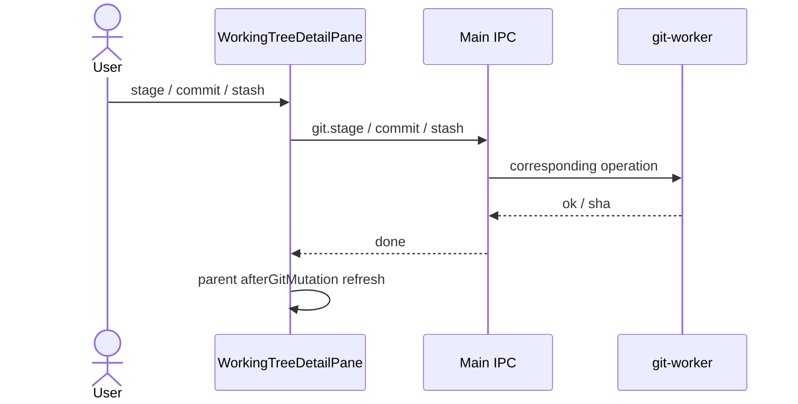

# Feature: Working tree & commits

## Purpose

Inspect and mutate the working tree: stage/unstage, discard, stash, commit (including amend), and set Git author identity used for new commits.

## User flow

1. Switch to **Changes** (or select the working-copy row).
2. Browse staged / unstaged / untracked lists; open a file for staged or unstaged Monaco diff.
3. Stage paths, write a message, Commit (optional Amend).
4. Stash panel: stash (includes untracked), apply / pop / drop entries.
5. Identity modal: set `user.name` / `user.email` at local or global scope.

## Key modules & files

| Piece | File |
|---|---|
| Changes pane | [`src/renderer/src/features/changes/WorkingTreeDetailPane.tsx`](../../src/renderer/src/features/changes/WorkingTreeDetailPane.tsx) |
| Identity modal | [`src/renderer/src/features/identity/IdentityModal.tsx`](../../src/renderer/src/features/identity/IdentityModal.tsx) |
| Status / stage / commit / stash / identity | [`src/git-worker/operations.ts`](../../src/git-worker/operations.ts) |
| IPC surface | [`src/shared/ipc/channels.ts`](../../src/shared/ipc/channels.ts) (`git:*`, `history:working-tree-diff`) |

## Data touched

- Index and working tree via Git
- Stash reflog
- Local/global Git config for identity
- Reads `StatusEntry`, `DiffResult`, `StashEntry`, `GitIdentity`

## Edge cases & rules

- Discard is destructive for unstaged/untracked paths — UI should confirm where appropriate.
- Conflicted paths surface in status and typically open the merge editor from the shell.
- Empty repo (no HEAD) forces Changes view after history load.
- Identity email must be a valid email when setting via `SetGitIdentityRequestSchema`.

## Diagram

